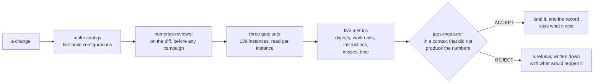

# JAOS — Just Another Optimization Solver

JAOS solves linear and mixed-integer programs. It is written from scratch in
C23, links nothing but libc and libm, builds to one static library with GCC on
Linux, and is licensed under Apache 2.0.

Two properties hold on every commit. The answer is bit-identical on every
machine and every run: no clock decides anything, no iteration order depends
on an address, and floating-point contraction is off. And an answer counts
only when an independent checker, which shares no code with the solver,
accepts it against the model as the caller loaded it.

## Status

The last tagged release is 0.2.0, from 2026-09-02. `main` carries everything
landed since, listed under *Unreleased* in `CHANGELOG.md`. The current
milestone is M2, which is about speed; `SPECS.md` states its success
criterion.

This is a working solver and not a finished one. It answers all 139 Netlib
reference instances correctly and solves 24 MIPLIB 3 instances to their
catalogue optima. It is slower than the established open-source LP solvers
by a factor that is measured and published, not estimated. The numbers are
in the results section below.

## What it does

```c
#include "jaos.h"

/* Every call returns a jaos_status. Error handling is left out here. */
jaos_model *m;
jaos_model_new(&m);
jaos_read_mps(m, "model.mps");
jaos_solve(m);

if (jaos_status_of(m) == JAOS_SOLVE_OPTIMAL) {
    double obj;
    jaos_objective(m, &obj);
    /* x holds jaos_num_col(m) values; the row arrays jaos_num_row(m). */
    jaos_solution(m, x, row_activity, row_dual, col_dual);
}
jaos_model_free(m);
```

**Files.** Reads fixed and free MPS, and the CPLEX-style core of the LP
format; `docs/format-support.md` lists what is outside that subset. Reads a
gzip-compressed file wherever it reads a plain one, with an inflate written
here. Writes MPS, LP and its own solution file, and reads a solution file
back. What JAOS writes, JAOS reads back as the same model; where a format
cannot hold what the model holds, the call fails and names the row or
column.

**Linear programs.** Presolve with six reduction families, and a postsolve
that returns values, statuses and duals in terms of the caller's original
model. Curtis-Reid scaling. Sparse LU factorization with Markowitz threshold
pivoting and Forrest-Tomlin updates. A dual simplex with steepest-edge
pricing, a Harris two-pass ratio test with bound flipping, dual phase 1 by
artificial bounds, and Bland's rule when a stall is detected.

**Mixed-integer programs.** A column can be marked integer from the API,
from an MPS `MARKER` pair, or from an LP `General` or `Binary` section. A
model with one solves by branch and bound over the same dual simplex, best
bound first, one private copy re-bounded per node and warm from its parent.
At the root: Gomory, knapsack cover and mixed-integer rounding cuts, a
rounding heuristic, a dive of up to fifty re-solves, and a feasibility pump.
Below the root: Gomory cuts down to depth 3, a cut dropped once its slack is
basic, the rounding heuristic at every node, pseudocost branching. The tree
reports its nodes, cuts and bound, takes a node limit beside the work and
time limits, tells a callback of every new incumbent, and keeps a pool of
the best integer points it met. Every default was set on a MIPLIB 3 set with
its own baseline (`make miplib`). Variants that measured worse stay behind
switches and off; `SPECS.md` names each one with its reading.

**After the answer.** The independent checker verifies every answer against
the original, unscaled model. Sensitivity and ranging for every cost, row
bound and column bound. A Farkas certificate behind an infeasible answer and
a ray behind an unbounded one. An irreducible infeasible subsystem. An exact
rational proof that the final basis is optimal, and the exact values of that
basis.

**A model is not read-only.** One bound, cost or coefficient at a time, the
objective's sense or constant, or whole rows and columns added or deleted;
every one of those reads back, the matrix by column, by row or by entry. A
re-solve starts from the previous basis. A callback can watch a solve and
stop it, and a stopped solve keeps its basis, so raising the limit continues
from where it stopped.

**Command line.** `make cli` builds `jaos`. `jaos solve model.mps` prints
the status, the objective, the counts and the time, one per line, and every
line but the time is byte-identical between runs; the exit code is the
verdict. `jaos convert` moves between formats, `jaos check` judges a solution
file, `jaos iis` names an infeasible subsystem, `jaos verify` runs the exact
proof, `jaos ranging` prints the ranges. Every branch-and-bound switch is a
flag. [`docs/cli.md`](docs/cli.md).

**Python.** `python/jaos.py` over `libjaos.so`, standard library only, so it
needs no compiler and no packages. Models are written directly, or loaded
from a file; every C call is reachable. `make shared`, then
`make python-test`.

```python
p = jaos.Problem()
x = p.add_var(ub=4)
y = p.add_var(integer=True)
p.add(x + y <= 4)
p.maximize(x + 2*y)
p.solve()
```

`SPECS.md` lists every feature with its status: what exists, what is
missing, and what is only partly there.

## What it does not do

There is no barrier method and no crossover. A primal simplex exists behind
a development switch and no caller can reach it; `make primal` measures it,
and the one thing it still lacks is Devex pricing, whose published form is
behind a paywall. The LP reader takes a subset of the format and refuses the
rest with a line number; there are no SOS or indicator constraints.

The API selects no method. A caller sets tolerances, limits, where the log
goes, callbacks, and the branch-and-bound switches. Which pricing rule runs,
when the factorization is refreshed, whether a sparse or a dense path is
cheaper: each of those is a constant, measured and fixed in the source, with
its measurement in `docs/tolerances.md`.

## Results

### Correctness

The acceptance gate is the Netlib collection: 94 standard instances, 16 from
the Kennington set, and 29 that have no feasible point. On the current tree
every feasible instance solves to the published optimum within the gate's
tolerance, the checker accepts all 110 answers, and the 29 infeasible models
are refused. `bench/README.md` owns those counts.

A fourth set is for the tree and is not a gate: 24 MIPLIB 3 instances, each
solved to the catalogue's integer optimum, the point integral and feasible
to the checker, two cold searches building the same tree node for node
(`make miplib`).

Two finer statements, each with the measurement behind it:

- The published objective is the correctly rounded value of `c'x` over the
  published point on 109 of the 110. The remaining one, `finnis`, sits at
  the checker's own floor (D172).
- The published point is the optimum. The worst remaining gap is `pilot` at
  5.27e-09, and `pilot87` and `scsd6` match the Koch reference exactly
  (D184).

### Speed

`make compare` times JAOS against HiGHS, SoPlex and Clp, with each solver's
own presolve on and the dual simplex forced on every side. The reading below
is from 2026-08-30; `bench/compare/README.md` owns it and says how it was
taken.

| P0, 2026-08-30 | vs HiGHS 1.15.1 | vs SoPlex 8.0.3 | vs Clp 1.17.11 |
|---|---|---|---|
| time per solve | 3.60x | 1.12x | 2.96x |
| iterations | 1.78x | 0.73x | 1.56x |
| time per iteration | 2.02x | 1.52x | 1.90x |
| JAOS faster on | 1 of 17 | 10 of 21 | 1 of 14 |
| worst instance | `stocfor3`, 27.4x | `grow22`, 14.8x | `stocfor3`, 22.8x |

JAOS takes fewer iterations than SoPlex, and the cost of one iteration is
what separates it from the field everywhere. That is what milestone M2 works
on. The worst instance is a presolve gap: HiGHS reduces `stocfor3` strongly
and JAOS barely touches it.

## How a change gets in

Every number above is a measurement, and this is the machinery that produces
them. A solver's failure mode is a wrong answer, and a wrong answer looks
exactly like a right one until something independent checks it. Nothing here
is accepted on a summary line.



- Every reference instance is compared against a committed baseline, per
  instance. A line reading `0 regressed` means only that no check flipped
  and nothing crossed a 2.0x work bar.
- The checker re-verifies every answer against the model as loaded. The
  solver reporting `optimal` counts for nothing by itself.
- A refusal is a result. `DECISIONS.md` records what was rejected and the
  measurement that rejected it, and `make refusals` re-tests those reasons,
  because a refusal is only true on the tree that measured it.
- `make test` reads the documentation and fails when it disagrees with the
  code: a cited decision that does not exist, a constant whose documented
  value differs from the source, a feature the record still calls missing.

The whole cycle is in
[`docs/development-cycle.md`](docs/development-cycle.md).

## Build and test

GCC 14 or later, Linux only.

```
make              # the static library, build/release/libjaos.a
make test         # unit suite, the CLI's test, and the check that the documents match the code
make sanitize     # unit suite under ASan and UBSan
make configs      # the suite in all five build configurations, from clean
make netlib       # the 94-instance acceptance gate (fetches the instances first)
make miplib       # the 24-instance MIP set, not a gate; run it when the tree changes
make compare      # time JAOS against HiGHS, SoPlex and Clp
make pgo          # rebuild the library from a profile of it solving real models
make shared       # build/release/libjaos.so, which the Python binding loads
make python-test  # the binding's own suite; not part of `make test`
make cli          # the command-line tool, build/cli/jaos
```

`make netlib-kennington` and `make netlib-infeas` run the other two reference
sets, and every set takes `J=N` to run N instances at a time. `bench/fetch.sh`
downloads the instances and checks them against pinned sha256 hashes; they
never enter this repository.

`make` builds with `-O3 -flto -g -DNDEBUG`, and every flag that measured a
gain is already in that default. Profile-guided optimisation, `make pgo`, is
worth 1.112x on top and is not the default because it needs the fetched
instances to build. `-march=native` measured inside the noise and is off.
The measurements and the switches are in [`docs/build.md`](docs/build.md).

## Layout

```
include/jaos.h        the public header, the only one
src/                  library sources
tests/                unit suite; tests/vendor/unity/ is the one vendored dependency
python/               the binding, over ctypes and the standard library only
cli/                  the command-line tool, over the public header only
bench/                instance manifests, the acceptance runner, results
bench/compare/        the harness that times JAOS against other solvers
bench/measurements/   one directory per measured verdict, so it is re-derivable
docs/                 formats, tolerances, scaling, work units, the build, the cycle
docs/research/        designs worked out on paper, with the literature checked
```

## The documents, and which to read

To use the library: `include/jaos.h` is documented in place, and
`SPECS.md` says what exists and what does not.

To understand how anything here is judged:
[`docs/development-cycle.md`](docs/development-cycle.md).

To work on it, the record is five places, and a statement lives in exactly
one of them:

- `SPECS.md`: every feature and where it stands.
- `TODO.md`: what is open, in the order it should happen. Its first section
  is a handover, and it is where a contributor starts.
- `DECISIONS.md`: every closed decision, with the measurement that closed it.
  A refusal is a closed decision too.
- `CHANGELOG.md`: what landed and what it cost.
- `docs/` and `bench/`: the contracts behind every constant in the code, the
  gate, the cross-solver comparison, and the raw readings behind each verdict
  under `bench/measurements/<id>/`.

These documents record the design. Do not reconstruct it from the code.

## Licence

Apache 2.0. See `LICENSE`.
