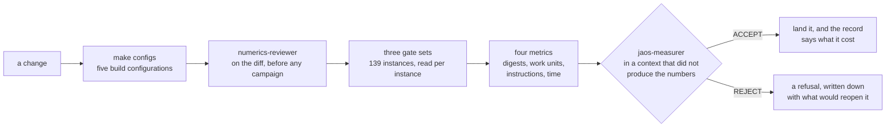

# JAOS — Just Another Optimization Solver

JAOS is a linear-programming solver written from scratch in C23. It reads a
model from an MPS or LP file, presolves it, solves it with a revised dual
simplex, and checks the answer with a verifier that shares no code with the
solver. It has no external dependencies, builds to one static library with
GCC on Linux, and is licensed under Apache 2.0.

Two properties hold on every commit, and every change is measured against
them. The result is bit-identical on every machine and every run: no clock
decides anything, no iteration order depends on an address, and floating-point
contraction is off. And an answer counts only when the independent checker
accepts it against the model as the caller loaded it.

## Status

The last tagged release is 0.1.1, from 2026-08-20. `main` carries everything
landed since, and `CHANGELOG.md` lists it under *Unreleased*. The current
milestone is M2, which is about the cost of an iteration; `SPECS.md` states
its success criterion.

This is a working solver and not a finished one. It answers all 139 Netlib
reference instances correctly, and it is slower than the established
open-source solvers by a factor that is measured and published rather than
estimated. Both statements have numbers, in the section on results below.

## What it does

```c
#include "jaos.h"

/* Every call returns a jaos_status. Error handling is left out here. */
jaos_model *m;
jaos_model_new(&m);
jaos_read_mps(m, "model.mps");
jaos_solve(m);

if (jaos_status_of(m) == JAOS_SOLVE_OPTIMAL) {
    double obj;
    jaos_objective(m, &obj);
    /* x holds jaos_num_col(m) values; the row arrays jaos_num_row(m). */
    jaos_solution(m, x, row_activity, row_dual, col_dual);
}
jaos_model_free(m);
```

- Reads fixed and free MPS, and the CPLEX-style core of the LP format.
  `docs/format-support.md` lists what is outside that subset.
- Reads a gzip-compressed file wherever it reads a plain one. The inflate is
  written here, because JAOS links nothing but libc and libm.
- Usable from Python: `python/jaos.py` over `libjaos.so`, standard library
  only, so it needs no compiler and no packages. `make shared`, then
  `make python-test`.
- Presolve with six reduction families. Postsolve returns values, statuses
  and duals in terms of the caller's original problem.
- Curtis-Reid scaling.
- Sparse LU factorization with Markowitz threshold pivoting and Forrest-Tomlin
  updates.
- Dual simplex: steepest-edge pricing, a Harris two-pass ratio test with bound
  flipping, dual phase 1 by artificial bounds, and Bland's rule as a fallback
  when a stall is detected.
- An independent checker that verifies every answer against the original,
  unscaled problem.

A loaded model can be modified: one bound, cost or coefficient at a time, or
whole rows and columns added or deleted. A re-solve then starts from the basis
of the previous solve instead of from scratch. A callback can watch a running
solve and stop it. A stopped solve keeps its basis, so raising the limit and
solving again continues from where it stopped.

`SPECS.md` lists every feature with its status: what exists, what is missing,
and what is only partly there.

## What it does not do

JAOS writes no files, and it can be called only from C. There is no barrier
method and no mixed-integer solver.

A primal simplex exists but no caller can reach it. It sits behind a
development switch rather than an option, and `make primal` is what measures
it. On the 94 standard instances it agrees with the dual on 56. The missing
pieces are named in `SPECS.md`: the Harris ratio test in primal form, Devex
pricing, and the unboundedness verdict.

The public API has forty-three functions. Seven of them configure something:
two tolerances, two budgets, where the log goes, how much of it there is, and
a callback that decides whether a solve continues. No function selects a
method. The solver decides which pricing rule runs, when it refactorizes, and
whether a sparse or a dense path is cheaper. Each such constant is measured,
fixed in the source, and not exposed as an option.

## Results

### Correctness

The acceptance gate is the Netlib collection: 94 standard instances, 16 from
the Kennington set, and 29 that have no feasible point. On the current tree
every feasible instance solves to the published optimum within the gate's
tolerance, the checker accepts all 110 answers, and the 29 infeasible models
are refused. `bench/README.md` owns those counts and explains how the three
sets are composed.

Two finer statements, each with the measurement behind it:

- The published objective is the correctly rounded value of `c'x` over the
  published point on 109 of the 110. The remaining one, `finnis`, sits at the
  checker's own floor (D172).
- The published point is the optimum. Four standard instances used to stop
  measurably short of it. Since D184 the worst remaining gap is `pilot` at
  5.27e-09, and `pilot87` and `scsd6` match the Koch reference exactly. That
  cost 3.4% more work on the standard set and 9.8% on Kennington, and the
  gate passes on all three sets.

### Speed

`make compare` times JAOS against HiGHS, SoPlex and Clp, with each solver's
own presolve on and the dual simplex forced on every side. The reading below
is from 2026-08-17; `bench/compare/README.md` owns it and says how it was
taken.

| P0, 2026-08-17 | vs HiGHS 1.15.1 | vs SoPlex 8.0.3 | vs Clp 1.17.11 |
|---|---|---|---|
| time per solve | 3.15x | 0.95x | 2.57x |
| iterations | 1.55x | 0.63x | 1.31x |
| time per iteration | 2.04x | 1.51x | 1.95x |
| JAOS faster on | 1 of 17 | 11 of 20 | 2 of 13 |
| worst instance | `stocfor3`, 30.0x | `grow22`, 8.4x | `stocfor3`, 26.4x |

The iteration counts are competitive and the cost of one iteration is what
separates JAOS from the field. That is what milestone M2 works on. The worst
instance is a presolve gap: HiGHS reduces `stocfor3` strongly and JAOS barely
touches it, and `TODO.md` §5 carries that question.

That reading predates D184, which added 3.4% work on the standard set. `make
compare` reproduces the table on the current tree.

## How a change gets in

Every number above is a measurement, and this is the machinery that produces
them. A solver's failure mode is a wrong answer, and a wrong answer looks
exactly like a right one until something independent checks it. So nothing
here is accepted on a summary line.



`numerics-reviewer` and `jaos-measurer` are review roles defined under
`.claude/agents/`: one reads a diff for the defect classes tests do not
catch, the other runs every instance set on a finished candidate and returns
a verdict. A person can follow the same definitions.

- Every one of the 139 reference instances is compared against a committed
  baseline, per instance. A line reading `0 regressed` is not evidence on its
  own: it means no check flipped and nothing crossed a 2.0x work bar.
- The independent checker re-verifies every answer against the model as
  loaded. The solver reporting `optimal` counts for nothing by itself.
- A refusal is a result. `DECISIONS.md` records what was rejected and the
  measurement that rejected it, and `make refusals` re-tests those reasons,
  because a refusal is only true on the tree that measured it.
- `make test` reads the documentation and fails when it disagrees with the
  code: a cited decision that does not exist, a constant whose documented
  value differs from the source, a feature the record still calls missing.
  Its first run found 147 such failures.

The whole cycle, with every step and the full diagrams, is in
[`docs/development-cycle.md`](docs/development-cycle.md).

## Build and test

GCC 14 or later, Linux only. On Windows, use WSL.

```
make            # the static library, build/release/libjaos.a
make test       # unit suite, plus a check that the documents match the code
make sanitize   # unit suite under ASan and UBSan
make configs    # the suite in all five build configurations, from clean
make netlib     # the 94-instance acceptance gate (fetches the instances first)
make pgo        # rebuild the library from a profile of it solving real models
```

`make netlib-kennington` and `make netlib-infeas` run the other two reference
sets, and all three take `J=N` to run N instances at a time. `bench/fetch.sh`
downloads the instances and checks them against pinned sha256 hashes; they
never enter this repository.

`make` builds with `-O3 -flto -g -DNDEBUG`, and every flag that measured a
gain is already in that default. LTO is the only flag with a measured effect,
at 1.033x; profile-guided optimisation, `make pgo`, is worth 1.112x on top and
is not the default because it needs the fetched instances to build.
`-march=native` measured inside the noise and is off. The measurements, and
the two switches `NATIVE=1` and `LTO=0`, are in [`docs/build.md`](docs/build.md).

## Layout

```
include/jaos.h        the public header, the only one
src/                  library sources
tests/                unit suite; tests/vendor/unity/ is the one vendored dependency
bench/                instance manifests, the acceptance runner, results
bench/compare/        the harness that times JAOS against other solvers
bench/measurements/   one directory per measured verdict, so it is re-derivable
docs/                 formats, tolerances, scaling, work units, the build, the cycle
docs/research/        designs worked out on paper, with the literature checked
```

## The documents, and which to read

To use the library: `include/jaos.h` is documented in place, and
`SPECS.md` says what exists and what does not.

To understand how anything here is judged:
[`docs/development-cycle.md`](docs/development-cycle.md).

To work on it, the record is five places, and a statement lives in exactly
one of them:

- `SPECS.md`: every feature and where it stands.
- `TODO.md`: what is open, in the order it should happen. Its first section
  is a handover, and it is where a contributor starts.
- `DECISIONS.md`: every closed decision, with the measurement that closed it.
  A refusal is a closed decision too.
- `CHANGELOG.md`: what landed and what it cost.
- `docs/` and `bench/`: the contracts behind every constant in the code, the
  gate, the cross-solver comparison, and the raw readings behind each verdict
  under `bench/measurements/<id>/`.

These documents record the design. Do not reconstruct it from the code.

## Licence

Apache 2.0. See `LICENSE`.
