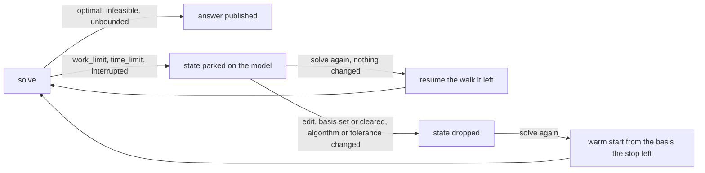

# The command-line tool

`jaos` solves a model from a file, converts one between the formats JAOS
reads and writes, and runs the library's five analyses on a model: the
independent checker, the infeasible subsystem, the feasibility relaxation,
the exact verifier and ranging. It is a thin program over the public API: it links `libjaos.a`
through `include/jaos.h` like any other consumer, and it can do exactly what
the library can do. `make cli` builds it as `build/cli/jaos`, and `make test`
compiles it and runs its test, `tests/cli.sh`.

## Usage

```
jaos solve FILE [--solution OUT] [--start SOLUTION] [--work-limit N]
                [--mip-start SOLUTION] [--cutoff V]
                [--basis BAS] [--write-basis BAS]
                [--write-point PT] [--write-duals D] [--pool-out PRE]
                [--proof PATH]
                [--time-limit SECONDS] [--primal-tol T] [--dual-tol T]
                [--threads N]
                [--cut-rounds N] [--cover-rounds N] [--cut-depth D]
                [--clique-rounds N] [--zero-half-rounds N]
                [--flow-cover-rounds N]
                [--node-cut-cap K] [--cut-stall F] [--node-cut-stall F]
                [--root-cut-drop | --no-root-cut-drop]
                [--cover-lift | --no-cover-lift] [--mir-rounds N]
                [--dive] [--dive-child RULE] [--dive-backtrack N]
                [--dive-gap F] [--node-mir | --no-node-mir]
                [--mir-aggregate N] [--dive-heuristic N]
                [--dive-heuristic-depth D] [--rins N]
                [--local-branching K]
                [--tree-batch N]
                [--dive-degrade F] [--feaspump N]
                [--pump-general 0|1] [--pump-obj F]
                [--pump-always | --no-pump-always]
                [--rcfix | --no-rcfix] [--tighten | --no-tighten]
                [--restart | --no-restart]
                [--probing | --no-probing] [--probing-cap M]
                [--clique-fix | --no-clique-fix]
                [--conflicts | --no-conflicts]
                [--symmetry | --no-symmetry] [--orbital | --no-orbital]
                [--propagate N]
                [--propagate-depth D]
                [--algorithm dual|primal|barrier|pdlp|concurrent]
                [--no-heuristics]
                [--opt NAME=VALUE]... [--params FILE]
                [--node-limit N] [--branching RULE]
                [--node-select RULE]
                [--reliability N] [--probe-cap M] [--probe-depth D]
                [--no-cut-drop] [--pool-size K] [--log LEVEL]
                [--check] [--quiet]
jaos convert IN OUT [--positional]
jaos check FILE SOLUTION [--tol T]
jaos check FILE --proof PROOF
jaos check FILE --point POINT [--duals DUALS] [--tol T]
jaos stats FILE
jaos options [--opt NAME=VALUE]... [--params FILE]
jaos diff A B
jaos show FILE (--row NAME | --col NAME)
jaos iis FILE [--write OUT] [--positional] [--work-limit N]
jaos relax FILE [--rows | --cols] [--apply OUT] [--positional]
             [--work-limit N]
jaos verify FILE [--values] [--proof PATH] [--basis BAS]
             [--work-limit N]
jaos ranging FILE [--work-limit N]
jaos STUB -AMPL [NAME=VALUE]...
jaos --version
jaos --help [COMMAND]
```

**The branch-and-bound switches are the long half of that list, and every
one of them has a measurement behind it.** A default is a setting that was
swept and won; a switch that is off is one that was built, measured and
refused, and it stays reachable so the refusal can be re-tested.
`bench/refusals.txt` names what would reopen each, and `make refusals`
runs the ones with a script. None of them changes an LP.

Options take their value as the next argument: `--work-limit 1000`, not
`--work-limit=1000`.

Every command prints one fact per line on stdout, as `key value`. Rows and
columns are named as the file names them; a constraint an LP file left
unlabelled is called by its position, `R<I+1>` counting from 1, and a
column `C<J+1>`. The exception is `at_row` and `at_col` in
`check --proof` and `verify`, which print the 0-based index of the row
or column. Numbers are printed with 17 significant digits, so
they read back as the same double; an infinite bound reads `inf` or `-inf`.
Everything that is not a fact about the model goes to stderr.

## `solve`

`solve` reads `FILE`, solves it, and prints one fact per line on stdout:

```
status optimal
objective 29
iterations 3
work_units 412
time 0.000087
```

- `status` is one word: `optimal`, `infeasible`, `unbounded`, `work_limit`,
  `time_limit`, `node_limit`, `numerical_error` or `interrupted`. On
  `numerical_error` the reason the library gives goes to stderr as
  `jaos: FILE ends numerical_error: REASON` (since 2026-09-19). A solve
  whose point makes the objective overflow a double ends
  `numerical_error` with that reason (since 2026-09-21); before, it ended
  `optimal` with an objective of `inf`. In a branch and bound, a node whose
  relaxation fails is set aside with its bound and the tree goes on (since
  2026-09-22; before, the first such node ended the tree). The tree then
  ends `optimal` only when its incumbent is within the gap of every bound
  set aside, and `numerical_error` with the first such node's reason
  otherwise.
- `objective` is printed only when the solve found an optimum. The library
  refuses to give an objective for any other outcome, because a number
  cannot be told apart from a genuine objective of zero, and the tool
  respects that refusal. The value is printed with 17 significant digits, so
  it reads back as the same double.
- `iterations` and `work_units` are the solve's own counts.
- `nodes`, `cuts`, `heuristic_points`, `first_incumbent` and `bound` are
  printed when a branch and bound solved at least one node. They are the
  relaxations the tree solved, the rows the cut rounds added (at the root
  and at the nodes down to `--cut-depth`), the incumbents any heuristic
  found (the rounding, the root dive, the pump, RINS, local branching and
  the fixed solve at the root of a quadratic model), the node at which the
  first incumbent appeared (0 when none), and the best objective any open
  node could still reach, which is the optimum when the status is
  `optimal`. `incumbent`
  follows `bound` when the tree holds an integer point (since 2026-09-19),
  so a tree stopped by a limit says what it found as well as how far off it
  might be.
- `time` is the solve's wall-clock seconds. It is the last line of the
  solve's own report. `--check`, `--pool-out` and `--proof` print their
  lines after it.

`--quiet` prints the `status` line and none of the rest of the solve's
report. The lines of `--check`, `--pool-out` and `--proof` still print.

**Where presolve fired, four more lines follow the counts**:
`presolve_rows`, `presolve_columns` and `presolve_nonzeros` are the model
the simplex actually ran on, and `presolve_rounds` is the cascading loop's
own count. A model presolve does not touch prints none of the four, and
neither does a build with presolve compiled out.

**A mixed-integer solve prints its own lines**, in this order: `nodes`,
`cuts`, `heuristic_points`, `first_incumbent`, `fixed_cols`, `tightened`,
`symmetry_generators`, `symmetry_orbits` and `bound`, then `incumbent`
and `pool_points` when they apply. `fixed_cols` counts the bounds
`--rcfix` moved and `tightened` the bounds `--propagate` moved; each reads
0 when its switch is off. An LP prints none of them.

### What is reproducible

Every line but `time` is byte-identical between two runs of the
same file with the same options, on any machine. The `time` line is the
one number JAOS reports that is not reproducible. `grep -v '^time '`
removes it before a diff. `head -n -1` removes it only when `--check`,
`--pool-out` and `--proof` are absent, because their lines follow it. Do not
put the `time` line in a file you diff against later.

One exception: a run that stops on `--time-limit` or on Ctrl-C is cut by a
clock, and where a clock cuts is not reproducible. Its `iterations` and
`work_units` lines can differ between runs. A run that stops on
`--work-limit` is reproducible, because the work counter is deterministic.

A stop does not change the answer either, in-process. A solve that ends
`work_limit`, `time_limit` or `interrupted` leaves its whole state on the
model, the factorisation, its update chain, the pricing weights, the
shifts and the phase, and the next `jaos_solve` on that model goes on
from exactly where it stopped, so an LP stopped and solved on ends on the
answer the uninterrupted run ends on, to the bit, work and iterations
included: the counts go on across a stop, and a limit is a limit on the
whole walk, so a solve resumed under the limit that stopped it stops
again at once. Any edit to the model, a basis set or cleared, or a change
of algorithm or tolerance drops the parked state and the next solve
starts over, warm from the basis the stop left. The state is the solve's
own working set and is held until then, or until the model is freed. A
stop inside the settling re-entry after an optimum resumes that re-entry
from its first round. A MIP has no such state: its tree starts again and
reaches the same objective. Measured over 6000 generated models
(`bench/measurements/02-247/`). The tool cannot resume, since its
process ends with the solve; `--basis` is its warm start.



The solver's log, when `--log` asks for one, goes to stderr and never to
stdout. Logging never changes an answer: a model solved at `--log detail`
prints the same facts as the same model solved silently.

### Options

| option | what it does |
|---|---|
| `--solution OUT` | writes the solution file to `OUT`: the optimum when the solve found one, and the certificate when it proved the model infeasible or unbounded. A MIP carries a certificate when its root relaxation is infeasible, the relaxation's Farkas ray, which the checker confirms against the model as loaded before it is published; a MIP infeasible by integrality alone has none. A solve that stopped on a budget or an interrupt has no answer to write; no file is written and stderr says why. The file format is JAOS's own; `docs/format-support.md` describes it. |
| `--start SOLUTION` | warm-starts from the basis in `SOLUTION`, a file `solve --solution` wrote for this model: the statuses are read and handed to the model before the solve, so re-solving a model from its own answer costs no iteration. Either kind of file will do since D332 -- an optimum's, or a certificate's, which carries the basis the refusal stopped on -- so a run that ended INFEASIBLE resumes after one bound moves. A file for another model, or one carrying no basis at all, is refused with the library's message and exit 5. |
| `--basis BAS` | warm-starts from the basis in `BAS`, an MPS basis file: the format every solver in the field writes a basis in, so `BAS` may be another solver's. It is read and handed to the model before the solve, exactly as `--start` does with JAOS's own file. Not with `--start`: a solve begins in one place, and being handed two is a question the caller has to answer. A file whose names or count do not fit this model is refused with the library's message and exit 5. |
| `--write-basis BAS` | writes the basis the solve stopped on to `BAS`, in the same format. The rule is wider than `--solution`'s: an optimum, a refusal, an unboundedness and a stop on a budget all leave a basis, and only a solve with none at all does not -- one that never ran, one abandoned for numerical reasons, a verdict presolve reached with no simplex. That case is said on stderr and leaves the exit code the answer's, because the answer is not what went wrong. A path ending in `.gz` is compressed. |
| `--write-point PT` | writes the optimum's point to `PT` as a point file: one `NAME VALUE` line per column and nothing else. It is the shape another program's checker takes, and the shape `check --point` reads back. The rule is `--solution`'s: an optimum has a point and nothing else does, and a solve without one writes no file and says why on stderr. |
| `--write-duals D` | writes the row multipliers to `D` in the point file's shape, so `check --point P --duals D` has both halves without an awk in between. The rule is `--write-point`'s. |
| `--pool-out PRE` | writes one point file per solution pool entry: `PRE-0.pt` is the best, `PRE-1.pt` the next, in the order the pool keeps them. No two of them share their integer assignment. `--pool-size K` is what makes the pool bigger than the incumbent. An LP has no integer point, so nothing is written and stderr says so without changing the exit code. Each file is one `check --point` reads back. Prints `pool_files N`, the number of files written. |
| `--check` | runs the independent checker on the answer and prints its eighteen-field report, then a `check_ok` line. It is the report `check FILE SOLUTION` prints and it saves the round trip through a file. The exit code stays the solve's: a checker that could change it would make `solve` two commands with one name. It judges an optimum; a solve that ended otherwise has no point and no duals, which is said on stderr and changes nothing. On a model with cones, `max_cone_violation` follows the eighteen fields. `check_ok` is `yes` when the point is primal feasible and the duals are feasible or were not checked. The check always uses a tolerance of 1e-7, whatever `--primal-tol` says. |
| `--proof PATH` | writes the answer's exact proof to `PATH`. An optimum's proof is its coordinates, so the tool runs `jaos verify` first and writes nothing when the verdict is `broken` or `refused`, saying so on stderr. On an optimal MIP, or a model with a quadratic objective, cones or quadratic rows, `jaos verify` refuses the model with an error, and the tool exits 5 after printing its report. An infeasible or unbounded answer's proof is its certificate, and the tool derives the exact ray for it first. A double is an exact rational, but a multiplier computed in floating point is not the one that makes the combination cancel, so a file of doubles can say broken to the checker. When the exact ray cannot be derived (presolve settled the answer and left no basis, or the derivation ran out of limbs), the published doubles are written instead and the file is checked before it is handed over. When that check fails, nothing is written, stderr says so and the tool exits 5. The file is always plain text, whatever its name. `jaos check FILE --proof PATH` judges any of the three from the model alone. Prints `proof_file PATH` when it wrote one. |
| `--mip-start SOLUTION` | hands the branch and bound the integer point in `SOLUTION`, a file this model's `solve --solution` wrote, before it runs. It is checked at the root by the same acceptance every heuristic point gets, so a point that is not integral, or that sits outside a bound or a row, is refused and the search runs as if none had been given -- a starting point the caller got wrong is never published as an answer. What it buys is the pruning: the tree has a bound from node 1. No effect on an LP. |
| `--cutoff V` | drops every node whose relaxation cannot beat objective `V`, from node 1 and with no incumbent needed. It also gates what may become the incumbent, so a cutoff tighter than the true optimum ends the search `infeasible` and exits 1 -- the honest answer to "is there a solution better than this?", not a defect. `V` is in the model's own sense. No effect on an LP. |
| `--work-limit N` | stops the solve after `N` deterministic work units. `N` must be a positive integer. The outcome is `work_limit`. The stop lands at the next point the solver checks: within one iteration's step for an LP, and for a MIP within one sub-solve's step, since every solve the tree starts, at a node, after cuts, in probing and in the heuristics, runs under what is left of `N` and the tree ends when one of them stops on it. |
| `--time-limit SECONDS` | stops the solve after that many wall-clock seconds. Must be positive; fractions are fine. The outcome is `time_limit`. It is the one input that breaks bit-identity: where a run stops depends on the machine's clock, so two runs stopped by it can differ. `--work-limit` stops at the same point on every machine. |
| `--primal-tol T` | how far a variable may sit outside its bounds and still count as feasible. Default 1e-7. |
| `--dual-tol T` | how far a reduced cost may sit on the wrong side of zero. Default 1e-9, `DUAL_TOL` in `docs/tolerances.md`. |
| `--cut-rounds N` | rounds of Gomory mixed-integer cuts at the root of a mixed-integer model: one cut per fractional integer column of the relaxation's basis per round, kept for the whole tree. Default 1, the setting that measured 0.660x the plain tree's work with no instance past 2x; `0` turns them off. A negative count is a usage error. No effect on an LP. |
| `--clique-rounds N` | rounds of clique cuts at the root, beside the other rounds. Every all-binary row and finite side, read over literals, says which pairs of literals cannot both be 1; those pairs form a conflict graph, and a clique of it the point violates gives the cut "at most one of these". The clique is grown greedily from the literal with the largest value, in a fixed order, so the cuts are the same on every machine. Default 4; `0` for none. |
| `--cover-rounds N` | rounds of knapsack cover cuts at the root, beside the Gomory rounds: every all-binary row, each finite side read as a knapsack over literals, gives the greedy cover the point violates, extended by every heavier item. Default 4, the setting that measured 0.745x the work of the Gomory round alone over the MIP set with no instance past 2x; `0` turns them off. A negative count is a usage error. No effect on an LP. |
| `--zero-half-rounds N` | rounds of zero-half cuts at the root, beside the other rounds. Every row with integer coefficients on integer columns and an integer side, alone, in pairs and in triples of the tightest hundred, is halved; a column with an odd coefficient sum takes the bound row that makes it even; where the right-hand side comes out odd and the rows' slacks at the point sum below 1, the halved row rounded down is a cut the point violates. At most fifty per round. Default 0: at 1, 2 and 4 rounds the MIP set read 1.210x, 1.182x and 1.219x, `gt2` 2.91x and `enigma` 2.50x with their trees two to three times longer, and `mod010` 1.98x for the scan alone. |
| `--flow-cover-rounds N` | rounds of flow cover cuts at the root, beside the other rounds. A two-entry row `x - u y <= 0` with `y` binary gives `x` a variable upper bound; a row with every column at lower bound 0 and finite capacities on its inflow side is read as a single-node flow set, a flow cover is picked greedily by the fixed-charge slack `u (1 - y) - x` at the point, and the Padberg, Van Roy and Wolsey inequality is added where the point violates it, with `lambda y` in place of `x` on outflow columns whose capacity exceeds `lambda`. Default 0: the set has variable upper bounds on `blend2` and `dcmulti` only, and 1 to 4 rounds read 1.012x to 1.017x, `dcmulti` 1.49x with its tree 415 to 687 nodes. |
| `--cut-depth D` | one round of Gomory cuts at every node whose depth is at most `D`, each valid in its node's subtree and in the relaxation for exactly the nodes under it. Default 3, with `--node-cut-cap`'s four cuts per node, the pair that measured 0.835x the work of root-only cuts over the MIP set with no instance past 2x; `0` is the root only. A negative depth is a usage error. No effect on an LP. |
| `--node-cut-cap K` | at most `K` cuts per node below the root, the most efficacious kept, violation over the cut's norm. Default 4; `0` is no cap, and the root's rounds are never capped. A negative count is a usage error. Only matters with `--cut-depth`. |
| `--no-cut-drop` | carries a node's cut to every node under it even once its slack is basic there; by default a cut that does not bind at a node leaves the relaxation under it, and two nodes holding the same cuts share the rows. Only matters with `--cut-depth`. |
| `--dive` | dives from each selected node of a branch and bound: the child on the nearer side of the fraction is solved next and its sibling joins the open set, until a node is pruned or integral. Off by default: the plain dive reads 0.934x the work over the 23 MIPLIB 3 instances it finishes, and 0.855x on the mean primal plus dual gap of the 2017 set, but bell5 does not finish under it (D289-dive in `bench/refusals.txt`). No effect on an LP. |
| `--dive-child RULE` | which child the dive solves first, with `--dive`: `nearer`, the default, is the side the fraction is closer to; `up` and `down` are fixed; `pseudocost` is the direction whose expected objective loss is the smaller. An unknown rule is a usage error. No effect on an LP or without `--dive`. |
| `--cut-stall F` | ends the root's cut rounds after one that moved the bound by less than `F` of (1 + \|bound\|). Default 0, never: every fraction read at or above 1.007x over the MIP set. |
| `--node-cut-stall F` | gives no cut round to a node whose own round moved its bound by less than `F` of (1 + \|bound\|), and none to anything under it. Default 0, never: alone it reads 0.816x, and beside the root-cut drop every fraction leaves `bell5` at the cap. |
| `--root-cut-drop` | lets a root cut leave the relaxation below a node where its slack is basic, like a node's own cut. On by default: 0.799x the work over the MIP set, 13 better and 2 worse, none past 2x. `--no-root-cut-drop` keeps every root cut in every node. |
| `--cover-lift` | lifts each cover cut with Balas's coefficients instead of extending it by every heavier item. Off by default: 1.005x with `l152lav` past 2x. `--no-cover-lift` is the default. |
| `--mir-rounds N` | rounds of mixed-integer rounding cuts on the model's rows at the root, beside the Gomory and cover rounds: every row and finite side shifted to the bounds nearer the point, scaled by a few candidates, the most violated kept. Default 6, which measured 0.719x the work over the MIP set with none past 2x; `0` turns them off. |
| `--mir-aggregate N` | lets a MIR row absorb `N` others, substituting a continuous column out each time, before it is rounded. Default 0, the single-row form: the aggregate measured 1.140x at its best step count with `gen` past 2x. Only matters with `--mir-rounds`. |
| `--node-mir` | adds MIR cuts over a node's own bounds to its Gomory round, under the same cap. Off by default: 0.991x with two instances past 2x, and the same shape at every cap and depth. `--no-node-mir` is the default. |
| `--dive-backtrack N` | lets a dive resume from the deepest sibling it left, up to `N` times per dive. Default 0, every sibling to the open set at once: 0.992x at sixteen with two past 2x, 1.170x unbounded. Only matters with `--dive`. |
| `--dive-gap F` | resumes only while the waiting sibling's bound is within `F` of (1 + \|best open bound\|). Default 0, no bound on the resume: 1.067x at its tightest fraction and worse above. Only matters with `--dive`. |
| `--dive-degrade F` | goes on into a child only while the node's own bound is within `F` of (1 + \|its parent's\|), read before the node's own cut round. Default 0, no bound: 1.048x at best against the plain dive. Only matters with `--dive`. |
| `--dive-heuristic N` | at the root, on a copy of the relaxation as the cuts left it, fixes the integer column nearest an integer and solves again, up to `N` times, and judges an integral point like any heuristic point. Default 50: 1.032x the work with the first incumbent earlier on 6 of 24 and later on none. `0` turns it off. In a model with cones or quadratic rows each solve fixes half of the fractional integer columns instead (see `solve`). |
| `--dive-heuristic-depth D` | runs that dive at every node down to depth `D`, the root being 0. Default 0, the root alone: depth 1 reads 1.049x and depth 4 1.356x with four instances past 2x, a worse rate than the heuristics already on. |
| `--rins N` | fixes the integer columns an incumbent and a node's relaxation already agree on and runs the dive on the rest, up to `N` solves, once per distinct incumbent (after Danna, Rothberg and Le Pape). Default 0, off: it found a point on one instance of 24 and moved no first incumbent, because the root dive reaches them first. |
| `--local-branching K` | for each distinct incumbent, solves the model again as a small tree with one more row, which keeps the binary columns within `K` flips of the incumbent, stopped at `MIP_LOCAL_BRANCHING_NODES` nodes; a better point it finds becomes the incumbent (after Fischetti and Lodi). Default 0, off. On the 2017 set at 1e10 work units (`bench/measurements/02-286/`), 10 flips read 0.975x on the mean primal plus dual gap and 20 flips 0.992x, with no instance finished; 10 flips improve 10 incumbents, pk1 196 to 45, exp-1-500-5-5 102167 to 77608 and tr12-30 195766 to 167155 among them. |
| `--feaspump N` | rounds of the feasibility pump at the root: the relaxation's point is rounded, the copy is re-solved for the point nearest that rounding in L1, and the pair repeats. Default 20: 1.026x the work with the first incumbent at node 1 on six of 24 and later on none. `0` turns it off. It runs only while nothing has an answer yet. |
| `--pump-general 0\|1` | gives the pump an auxiliary column and two rows per general integer column, so such a column's distance to its rounding counts wherever the rounding sits (after Bertacco, Fischetti and Lodi). Off by default: 1.007x alone with `gt2` the only instance it moves, and the objective pump reaches `gt2` without it. |
| `--pump-obj F` | blends the model's own objective into each of the pump's rounds at a weight that multiplies by `F` per round from 1 (after Achterberg and Berthold), so early rounds pull toward good points and late ones toward feasible. Default 0.5: 0.984x the plain pump's work, 2 better and 0 worse, `gt2`'s first incumbent from node 382 to 1. `0` is the plain pump; `1` or more is a usage error. |
| `--pump-always` | runs the pump at the root even where something already holds an incumbent. Off by default: 1.051x, `gen` at 3.083x, and **the first incumbent moved on none of the 24** -- the guard is skipping a pump that would have found nothing. `--no-pump-always` is the default. |
| `--rcfix` | at the root, once an incumbent exists, pulls an integer column's far bound in to the furthest integer its reduced cost still allows, and every node inherits it. Off by default: 1.010x, `p0282` 0.519x against `gt2` 2.492x out of the same deduction. `--no-rcfix` is the default. |
| `--tighten` | at the root, a binary column whose coefficient in a one-sided row cannot make the row tight on its own has the coefficient shrunk by the row's slack and, for a positive coefficient in a `<=` row, the bound with it. No integer point moves and the relaxation gets a tighter face. On by default; `--no-tighten` turns it off. |
| `--probing` | after the root solve, each binary column fractional there is tried at 0 and at 1 with the rows propagated over the bounds, most fractional first, under `--probing-cap`; a setting that makes some row impossible fixes the column the other way, the bounds both settings imply are kept, a column that fits neither way makes the model infeasible, and a root that moved is solved again before the cuts. Off by default: 1.109x over the MIP set with no instance better, no column fixed on any of the 24, and the bounds it keeps moving bell3a's tree 64077 to 117317 nodes. `--no-probing` is the default. |
| `--probing-cap M` | stops the root's probing at `M` times the work the root solve itself took. `0` is no cap; a negative value is a usage error; 1 by default. No effect without `--probing`. |
| `--clique-fix` | at each node, a binary column fixed to one setting fixes every literal the root's clique table puts in conflict with it, and a node holding both sides of a conflict is cut without a solve. The table is built once after the root solve from the all-binary rows, plus the implications probing found, and feeds the clique cuts either way. Off by default: 1.026x over the MIP set, 6 better and 9 worse, `enigma` 1.853x with its tree 2814 to 5837 nodes, and no node cut by a conflict on any of the 24. `--no-clique-fix` is the default. |
| `--conflicts` | conflict analysis at a node whose relaxation is infeasible: the Farkas proof is read over the branching fixings on the path, each fixing the proof can do without is dropped, deepest first, and when the rest are binaries fixed to a value, at most 32 of them, a row forbidding that combination together is added ahead of the cut copies and kept for the rest of the search. On by default: 0.924x over the MIP set, 7 better and 5 worse, none past 2x, `egout` 0.206x with its tree 6841 to 887 nodes, `misc07` 1.106x for 1563 rows. `--no-conflicts` turns it off. |
| `--symmetry` | symmetry detection at the root: the model as a coloured graph (a vertex per column coloured by cost, bounds and kind, one per row coloured by its bounds, an edge per nonzero coloured by the coefficient), colour refinement to an equitable partition, then a partition search that individualises a vertex of the first cell with more than one member, refines, and reads an automorphism off each pair of leaves, under a work cap of `MIP_SYMMETRY_WORK` (250) times the model's size (nonzeros plus columns plus rows). Each automorphism found is a generator; the column orbits come from the generators. Every MIP solve prints `symmetry_generators` and `symmetry_orbits`. Off on its own, but `--orbital`, which is on by default, runs the same search; this switch matters with `--no-orbital`. |
| `--orbital` | orbital branching and fixing: at a node, the symmetries that fix every binary the path set to 1 (and every non-binary column it branched on) give the orbits; a branching on a binary zeroes its whole orbit on the zero side, and a node zeroes every orbit holding a binary the path zeroed. On by default: 0.835x over the MIP set, `rgn` 0.156x with its tree 4233 to 235 nodes, `misc07` 0.356x, `stein27` 0.543x, against `air03` 1.892x for the search alone. `--no-orbital` turns it off. |
| `--propagate N` | passes of bound propagation at each node before its relaxation is solved: each reads the model's rows over the node's own bounds, proves the node infeasible with no solve where a row admits no point, and pulls in the integer bounds the rows imply. Default 0, off: 1.093x at one pass and 1.074x at four, with `bell5` unfinished at the cap. On a model with a quadratic objective the default is 4 (`MIP_QUAD_PROPAGATE`). `jaos options` prints the unset value as -1 (`mip_propagate`). |
| `--propagate-depth D` | the deepest node propagation runs at, the root being 0; negative, the default, is every node. Depth 0 is not less propagation but the free half of it, since the root's deductions hold for the whole tree: 1.051x, and it moves a bound on 6 of 24 while the other 18 read exactly 1.000x. Only matters with `--propagate`. |
| `--algorithm A` | what solves an LP, one of five: `dual`, the default, `primal`, `barrier`, `pdlp` or `concurrent`. The two simplexes also solve the root relaxation and every node of a MIP; the barrier solves plain LPs only, and a MIP under `--algorithm barrier` still runs its relaxations on the dual. The primal takes more work than the dual on the Netlib set and is there for a caller who wants it; both give the same answer. The barrier is Mehrotra's predictor-corrector on the normal equations, factored by the sparse Cholesky in `src/chol.c` with the dense columns left out and corrected for on every solve, followed by a crossover: the interior point ranks every column and row by how far it sits inside its bounds against its dual slack, the best `rows` of them make a basis guess (repaired through the LU where it is singular). Since 2026-09-22 a push then puts every nonbasic column on one of its bounds, along the direction that keeps the rows satisfied, and a basic column that reaches its own bound first leaves the basis (the primal half of Bixby and Saltzman's push); the primal simplex finishes from that primal feasible basis. Where the push cannot finish, the dual simplex finishes from the guess under the ordinary warm start, as before. Either way the answer is a vertex with a basis like any other. `jaos_iterations` counts both parts. The barrier certifies neither infeasibility nor unboundedness, so a run whose iterate grows past `BARRIER_DIVERGE` times the data, turns non-finite, or reaches `BARRIER_MAX_ITER` without converging hands the model to the dual simplex, which starts from the slack basis and gives the verdict with its certificate; `jaos_iterations` counts both parts there too. `bench/results/barrier.txt` is its reading against the dual on the standard set and `bench/results/barrier-infeas.txt` on the infeasible one. A model with a quadratic objective (`QUADOBJ` in MPS, a `[ ... ] / 2` block in LP) solves by the barrier under the default `dual`, without presolve or crossover, and a MIP with one solves its root and every node by the barrier, cold at each node and without Gomory cuts; `primal` and `pdlp` refuse a quadratic objective and exit 5. Such a model takes the augmented system rather than the normal equations, since its quadratic part fills them; a diagonal quadratic part folds into the normal matrix instead, and there the barrier reads both factors' operation counts, `Σ_j h_j²` over the columns' heights, and keeps the cheaper. It only reads the second one when the normal factor costs at least `BARRIER_AUG_TRY`, because the symbolic analysis is billed too. `--log summary` says which system it took. When the barrier ends such a solve without an answer (`numerical_error`), the conic interior point described below solves the model again, root and nodes alike, its work units, iterations and time counted on from the barrier's, so the work and time limits hold for the two together. It runs as at the top of a solve even at a node, so a walk that stops near an optimum the checker refuses ends `numerical_error` rather than pass as a rough node. At the root of a MIP with a quadratic objective, while no incumbent is known, the relaxation's integer columns are rounded and the model is solved with them fixed; when that gives no feasible point, a dive fixes the half of the fractional integer columns nearest an integer at each solve, up to `--dive-heuristic N` solves, and rounds and solves its last point the same way. `--no-heuristics` or `--dive-heuristic 0` turns both off. `pdlp` is the first-order method: primal-dual hybrid gradient on the same scaled model after `PDLP_RUIZ_ROUNDS` of Ruiz equilibration and the Pock-Chambolle scaling, with the adaptive step and the restarts to the running average of Applegate et al. (2021), the primal weight rebalanced at each restart, every matrix pass billed; it stops at a relative tolerance of `PDLP_TOL` and finishes through the same crossover, hands off to the dual simplex the same way, and `bench/results/pdlp.txt` is its reading. `concurrent` is the portfolio: it copies the model three times, sets the dual on the first, the primal on the second and the barrier on the third, and runs them in that order under a work budget of `CONCURRENT_SLICE` that multiplies by `CONCURRENT_GROWTH` each round. The first run to answer wins and its answer, its basis and its certificate become the model's; the work is the sum over the three, so a model the dual settles inside the first budget costs exactly what the dual costs and the other two never start. Nothing reads a clock, so the winner is the same on every machine. It solves plain LPs only: a MIP under `--algorithm concurrent` runs its relaxations on the dual as under `barrier`, and a quadratic objective is refused as `primal` and `pdlp` refuse it. A model with second-order cones or quadratic rows (since 2026-09-19) solves by the conic interior point under `dual` or `barrier`, a homogeneous self-dual walk with Nesterov-Todd scaling (`src/conic.c`), finished by a Newton step on the constraints it ends on; `primal`, `pdlp` and `concurrent` refuse it and exit 5. The finish's point is taken when it is feasible on both sides, and also when the walk's own point is refused and the finish's worst violation is smaller. Since 2026-09-20 every column that leaves the finish sitting on a bound with a reduced cost pushing it the other way leaves its active set, and the finish runs again without them, up to `CONIC_NEWTON_ROUNDS` times. When the walk ends on an improving direction the ray checker refuses, or ends with no answer at all, the model goes to the feasibility solve and then to a solve over the directions the rows, the bounds, the quadratic parts and the cones leave open, and the answer is `unbounded` only with a direction that solve finds and the checker takes. The walk leaves out two kinds of quadratic cone. A cone whose head has an upper bound of 0 holds all its columns at 0, so the walk fixes them there; such a cone has no interior point, and the walk needs one. A cone whose head is free above, costs nothing and appears in no row and no other cone never binds, so its dual is 0, a point the walk cannot reach from inside; after the walk its head is set to the norm of the rest. The duals, certificates and rays published for the model cover both kinds, the first rebuilt from its columns' reduced costs, and `--log summary` counts them. When every cone goes that way and no row is quadratic, nothing conic is left and the model is solved by the algorithm it would have had without cones, on a copy with those columns fixed. Its `infeasible` comes with a certificate the checker takes; only a model with a quadratic row may end `infeasible` without one, since a diagonal part's curvature caps each column at `a^2 / (-2h)` and carries the proof, and on any other model a refused certificate ends `numerical_error`. A certificate the checker refuses is looked at again before that: the checker's test is sharp in the proportion between the multipliers and not in their scale, so the solve scales every quadratic row's multiplier by one factor, then moves one multiplier at a time against the checker, then negates a multiplier that curves its row the wrong way, then projects a cone dual back onto its cone. The search is capped, its cost is charged to `work_units`, and it does not run at a tree node. Such a model with integer columns solves by a branch and bound of its own (`src/conictree.c`): depth first until an incumbent, then best bound first with a plunge after each branching, the conic interior point at every node. A node whose relaxation fails is split at the middle of its widest integer column. A failed node with every integer column fixed is set aside with its bound, and the tree then ends `optimal` only when its incumbent is within the gap of every bound set aside, `numerical_error` otherwise; `--log summary` counts both. The column branched on is the one whose pseudocosts promise the largest gain, the product of the two directions' estimates, each the mean gain per unit a branch on that column has shown so far, with the mean over all columns standing in until it has one; so the root, knowing nothing, takes the most fractional column, and `--branching most-fractional` keeps that rule throughout. At the root, the relaxation's integer columns are rounded and the model is solved with them fixed (`--no-heuristics` turns this off). While no incumbent is known, the root then dives: each solve fixes the half of the fractional integer columns nearest an integer, up to `--dive-heuristic N` solves (default 50, `0` turns it off), and the last point is rounded the same way. The `mip_gap` option, `--branching`, `--node-limit`, `--cutoff`, `--mip-start` and the work and time limits apply to it, the cut options and the other heuristic options do not, and SOS sets, semi-continuous columns and indicator rows beside cones exit 5. |
| `--threads N` | the thread count, `1` by default. Four things run more than one: `--algorithm concurrent`, the barrier's Cholesky factor, and the rounds of nodes of the conic tree and of the linear tree under `--tree-batch` above 1. The conic tree solves a round's relaxations on up to `N` threads, each on its own copy of the model, and takes their answers in the round's own order; the rounds do not depend on `N`, so the tree, its bound, its node count and its `work_units` line are the same at any count and only `time` moves (`bench/measurements/02-264/`). The linear tree runs its rounds the same way (see `--tree-batch`). With `N` above 1 the concurrent solve starts its three methods at once instead of one after another, and the moment one of them answers every method behind it in the order stops, because a method behind the winner is never the one whose answer is published. The answer, the basis, the certificate and the `work_units` line are the same at any count, because the work billed is still the work the one-thread schedule would have done; the `time` line is the one that moves. Since 2026-09-22 the barrier factors its normal equations on up to `N` threads too: the rows of each block of `CHOL_BLOCK` are solved on their own threads, and the factor is bit-identical at any count, so again only `time` moves (dfl001 67.7 s to 38.8 s on four threads, `bench/measurements/02-288/`). `0` or a negative count is a usage error. |
| `--opt NAME=VALUE` | any option by name, repeatable; the same setters the flags above reach. Names: `work_limit`, `time_limit`, `threads`, `primal_tolerance`, `dual_tolerance`, `algorithm`, `log_level`, `mip_gap`, `mip_node_limit`, `mip_tree_batch`, `mip_branching`, `mip_reliability`, `mip_probe_cap`, `mip_probe_depth`, `mip_cut_rounds`, `mip_cut_depth`, `mip_cut_drop`, `mip_node_cut_cap`, `mip_cover_rounds`, `mip_cut_stall`, `mip_node_cut_stall`, `mip_root_cut_drop`, `mip_cover_lift`, `mip_mir_rounds`, `mip_node_mir`, `mip_mir_aggregate`, `mip_dive`, `mip_dive_child`, `mip_dive_backtrack`, `mip_dive_gap`, `mip_dive_degrade`, `mip_dive_heuristic`, `mip_dive_heuristic_depth`, `mip_rins`, `mip_feaspump`, `mip_pump_general`, `mip_pump_obj`, `mip_pump_always`, `mip_rcfix`, `mip_tighten`, `mip_probing`, `mip_probing_cap`, `mip_clique_fix`, `mip_conflicts`, `mip_symmetry`, `mip_orbital`, `mip_propagate`, `mip_propagate_depth`, `mip_heuristics`, `mip_pool_size`, `mip_cutoff`, `mip_clique_rounds`, `mip_zero_half_rounds`, `mip_flow_cover_rounds`, `mip_local_branching`, `mip_node_select`, `mip_restart`. A name matches in any case. Booleans take `true`/`false`, `on`/`off`, `yes`/`no` or `1`/`0`, also in any case. `mip_node_select` takes an integer: 0 for `bound`, 1 for `estimate`. `mip_gap` is the relative gap at which a branch and bound stops as optimal; it has no flag of its own, and its default is 1e-6. `log_level` takes effect only through `--log`: set by `--opt` or `--params` it prints nothing, because the tool installs its log callback only for `--log`. An unknown name or a value of the wrong kind is a usage error. |
| `--params FILE` | options from a file: one `name value`, `name = value` or `name: value` per line, `#` to end of line a comment. Read before the `--opt` flags, so `--opt` overrides the file. Every other flag overrides both, except `--threads`, `--work-limit`, `--time-limit` and `--reliability`: the tool applies those four first, so the file and `--opt` override them. |
| `--no-heuristics` | turns the rounding heuristic off: by default every fractional node's relaxation is rounded to the nearest integers and kept as the incumbent when it is inside every bound and row. In a model with cones or quadratic rows the rounding runs at the root only, with a solve of the continuous columns (see `solve`). No effect on an LP. |
| `--node-limit N` | stops a branch and bound before its `N`-th node past the limit, as `node_limit`, keeping the incumbent it has; `N` must be a positive integer. No effect on an LP. |
| `--tree-batch N` | how many open nodes a branch and bound takes in one round (`N >= 1`, default 1, the tree that takes one node at a time). A round holds at most 64 nodes, and a larger `N` is read as 64. A round's relaxations are solved on up to `--threads` threads and their answers are taken in the round's own order, so the answer, the bound and the work do not depend on the thread count. Above 1 the search itself changes. On CBLIB's 80 mixed-integer instances the conic tree's rounds of four reach the same optima with 0.85x the work, and a run stopped by a work limit tends to end with a better bound and a worse incumbent (`bench/measurements/02-264/`). The linear tree (since 2026-09-22) solves each node of a round on its own copy of its LP and then takes the nodes in order, each from its copy's final basis. It pays where a node takes many pivots: l152lav falls from 93.91 s to 35.11 s at rounds of 4 on four threads and 21.28 s at rounds of 8 on eight. Where a node takes a few, the copies and the second solves cost more: bell3a goes from 16.41 s to 27.72 s, and over MIPLIB 3 rounds of 4 cost 1.37x the work (`bench/measurements/02-290/`). An LP ignores it. The option name is `mip_tree_batch`. |
| `--branching RULE` | which column a fractional node branches on: `pseudocost`, the default, scores each column by the objective gain a unit move in each direction has cost so far in the tree; `most-fractional` takes the column farthest from an integer. The conic tree reads it too, with plain means for its pseudocosts and no probes. No effect on an LP. |
| `--node-select RULE` | which open node a branch and bound takes next when it does not dive. `estimate`, the default since 2026-09-22, is the lowest pseudocost estimate: the parent's bound plus the smaller gain of each fractional integer column, with the lowest bound taken every fifth pick. `bound` is the lowest bound, the order before. On the 2017 set at 1e10 work units the estimate reads 0.896x on the mean primal plus dual gap, and on MIPLIB 3 0.922x the work with bell5 at 1.694x (`bench/measurements/02-286/`). An unknown rule is a usage error. No effect on an LP. |
| `--restart` | at the root, once an incumbent exists, counts the integer columns the root's reduced costs would fix. When they are `MIP_RESTART_FRAC` of them or more, the tree starts again from the root with those columns fixed and the incumbent as its start. Off by default: on the 2017 set it never fired, at a fifth of the columns or at a twentieth. `--no-restart` is the default. No effect on an LP. |
| `--reliability N` | how many branches in each direction a column needs before its pseudocost is trusted; below it, at most eight candidates per node have their children solved on the spot and the gains initialise the pseudocosts. Default 0, never: over the MIP set reliability 1 reads 0.971x the work, but with mod010 at 2.84x and enigma at 2.07x, and 2, 4 and 8 read worse. No effect on an LP or under most-fractional branching. |
| `--probe-cap M` | stops each strong-branching child solve at `M` times the work the node's own relaxation took; a probe that reaches it teaches the pseudocost nothing. Default 0, no cap; a negative value is a usage error. No effect without `--reliability`. |
| `--probe-depth D` | strong branching probes at nodes down to depth `D` only, the root being 0; by default every depth. A negative depth is a usage error. No effect without `--reliability`. |
| `--pool-size K` | keeps the `K` best distinct integer points a branch and bound finds, best first, and prints `pool_points N`, how many it holds, whenever `--pool-size` is on the command line, 1 included. A size set by `--opt` or `--params` prints no line. `K` must be a positive integer. Default 1, the incumbent alone. Two points are distinct when they differ on an integer column: two vertices of one optimal face that differ only in a continuous column are one entry, the better of the two, which is how the field's solution pools count as well. A model whose discrete structure is SOS sets or semi-continuous columns alone has no integer column, and there two entries are distinct when they differ anywhere. |
| `--log LEVEL` | prints the solver's log on stderr. `LEVEL` is `off`, `summary`, `progress` or `detail`. Default `off`. |
| `--quiet` | prints the `status` line and none of the rest of the solve's report. The lines of `--check`, `--pool-out` and `--proof` still print. |

Both tolerances act in the scaled space the solver works in;
`docs/tolerances.md` says what that means. A value the library refuses, such
as a negative tolerance, is reported on stderr and the tool exits 5 before
reading the file.

Ctrl-C during a solve stops it at the next point the solver checks, and the
tool prints `status interrupted` and exits 3. It does not kill the process
mid-way.

## `options`

`jaos options` prints every option with its value, one `name value` per
line: the defaults, unless `--opt NAME=VALUE` or `--params FILE` on the same
command line changed one. The output is exactly what `--params` reads, so
`jaos options --opt ... > run.txt` saves a run's settings and
`jaos solve model.mps --params run.txt` replays them. `mip_propagate`
prints -1 while it is unset, which leaves the choice to the tree (4 passes
on a model with a quadratic objective, 0 otherwise), and a replayed -1
keeps that choice. Exit 0 unless an option
is unknown or its value is of the wrong kind, which is a usage error.

## `stats`

`jaos stats FILE` reads the model and prints what it is, one `key value`
per line. It solves nothing, which makes it the one analysis subcommand
with no verdict: the exit code is 0 unless the file cannot be read.

```
$ jaos stats model.mps
rows 27
columns 32
nonzeros 83
equality_rows 8
ranged_rows 0
one_sided_rows 19
free_rows 0
empty_rows 0
fixed_columns 0
ranged_columns 4
one_sided_columns 28
free_columns 0
empty_columns 0
integer_columns 0
binary_columns 0
semicontinuous_columns 0
sos_sets 0
indicator_rows 0
quadratic_columns 0
quadratic_rows 0
cones 0
objective_nonzeros 12
min_abs 0.109
max_abs 2.386
objective_min_abs 0.32
objective_max_abs 10
```

The four row counts partition the rows and the four column counts
partition the columns, so each set sums to its total; that is what the
tests check, because a count that is merely printed is not evidence that
the walk saw every row. A **ranged** row or column has two finite bounds
that differ, a **fixed** one has two that are equal, and a **free** one has
neither. **Binary** is what the branch and bound would see: the bounds
rounded inward to integers being exactly 0 and 1, not a pair
that happens to read 0 and 1 before rounding. The magnitude pairs are over
the nonzeros and over the nonzero costs, and their ratio is what scaling
exists to shrink. `quadratic_rows` counts the rows with a quadratic part
and `cones` the second-order cones (since 2026-09-19).

## `convert`

`convert` reads `IN` and writes `OUT`. The output format is chosen by
`OUT`'s extension: `.mps` writes free-format MPS, `.lp` writes CPLEX-style
LP, `.nl` writes AMPL's text `.nl` with the names in `.col` and `.row`
beside it, `.qplib` writes the QPLIB text format, `.osil` writes OSiL
XML, `.cbf` writes the Conic Benchmark Format (without names; see
`docs/format-support.md`), and any other extension is a usage
error. The readers take `.mps`, `.lp`, `.nl`, `.qplib`, `.osil` and
`.cbf` by extension. The output name is
checked before the input is read. The `.nl` writer lists the integer
columns last, as the format does, so a model whose integer columns sit
before a continuous one comes back in that order, names carried. It
refuses SOS sets, semi-continuous columns, indicator rows, cones,
quadratic rows and a quadratic objective. Write MPS, LP, QPLIB or OSiL
for a quadratic objective, and MPS for cones or quadratic rows, since
`.nl` carries them only as nonlinear bodies, which the writer does not
write.

**`--positional` takes every name off the model before writing**,
so the file comes out with `R1`, `C1` and `COST`. It is the escape hatch
for a model whose names you would rather not carry at all; a name the LP
dialect cannot spell is otherwise written under `c<j+1>` or `r<i+1>`
with a comment map at the top of the file saying what it was.
What is lost is the names and nothing else. Over the 139 gate instances
every LP conversion reads back and re-solves to the same status and
objective, with the names and with `--positional` alike
(`bench/measurements/02-274/`). The default keeps the names, because a
model with its own names is worth more to a person reading it.

**A `.gz` after either extension compresses the file**, so
`out.mps.gz` and `out.lp.gz` work and name the same two formats. That is
not special to `convert`: every path this tool writes to compresses when
it ends in `.gz`, `--solution`, `--write-basis`, `--write-point`,
`--write-duals`, `iis --write` and `relax --apply` included. The one
exception is the proof file of `solve --proof` and `verify --proof`,
which is always plain text, whatever its name. Every path the tool reads
takes a compressed file back: `--start`, `--basis`, `check`'s solution,
`--point` and `--duals`.
`docs/format-support.md`, "Compressed output", has the rule and what it
costs in size.

What JAOS writes, JAOS reads back as the same model, names included: the
input's names are written out, and a row or column the input did not name
is written by its position, `R<I+1>`, `C<J+1>`, `COST`. A name the
LP dialect cannot spell -- one holding a `-`, starting with a digit, or
spelling a keyword -- is written to LP under `c<j+1>`, `r<i+1>` or
`obj`, an underscore appended while the model holds that name too, and
a `\ column c2 was x-1` comment at the top of the file keeps the
original. MPS takes every name.

A write the format cannot express is refused: the tool prints the library's
message, which names the row or column, exits 5, and leaves no file behind.
`docs/format-support.md` lists what each format cannot express. A free
row goes to LP as `>= -inf` and a ranged row as two rows joined by a
`\ range` comment, the forms HiGHS reads too. When the LP writer refuses
a model, converting it to `.mps` instead works.

## `check`

`check FILE SOLUTION` reads the model from `FILE`, reads `SOLUTION`, a file
that `solve --solution` wrote, and judges what it holds with the library's
independent checkers. The checkers work on the model as loaded, in its
original units, and share no code with the solver. The first line says
which kind of answer the file claims, `status optimal`, `status
infeasible` or `status unbounded`, and that decides which checker runs and
which report follows.

For an optimum the checker judges the column values and row duals, and the
output is its report, one field per line, with the field names of
`jaos_check_report` in `include/jaos.h`:

```
status optimal
max_col_violation 0
max_row_violation 0
max_row_violation_relative 0
max_dual_violation 0
primal_objective 29
dual_objective 29
objective_gap 0
gap_positive 0
gap_negative 0
max_dropped_multiplier 0
dropped_terms 0
certified_suboptimality 0
unquantified_rays 0
relative_suboptimality 0
primal_feasible yes
dual_feasible yes
checked_duals yes
gap_certified yes
```

`docs/tolerances.md`, "The checker's tolerance", says what each number
means and why most of them decide nothing on their own. The struct also
has `max_integrality_violation`, which the tool does not print. The two
that decide are
`primal_feasible` and `dual_feasible`. The exit code is 0 when both are
`yes` and 1 otherwise.

**On a model with cones** the file has to carry the `cone` records that
`solve --solution` writes for one, and the check reads them as the
cones' duals: the dual half then also asks that each cone's dual lies in
the dual cone, and the report ends with `max_cone_violation`, how far
the column values lie outside the cones. An infeasible model's
certificate is judged with its cone part the same way. A file without
the records is refused with exit 5. `solve --check` on a model with
cones reads the duals the solve left. A quadratic row needs nothing
extra: its dual is its `row` record's, and the checker takes the row's
gradient `a + Qx` at the point.

On a model with integer columns, SOS sets, semi-continuous columns or
indicator rows the dual half does not run and `checked_duals` reads `no`.
The duals such an answer carries belong to the last node of the tree, and
LP duality does not close a MIP's gap, so the dual test would measure the
integrality gap and call a right answer wrong. The primal half decides
there, and it already counts the integrality violation and the SOS
nonzeros.

For a certificate the file carries one `ray` record per row when the
model was proved infeasible, or per column when it was proved unbounded,
and the matching checker judges it from the model alone. The report is
`jaos_certificate_report`'s fields for an infeasible file and
`jaos_ray_report`'s for an unbounded one, then `certified`:

```
status infeasible
sup_columns 4
inf_rows 7
gap 3
certified yes
```

For an unbounded quadratic model the ray also has to be flat: `curvature`
is `d'Qd` along the ray, and `certified` needs it within the tolerance
times the largest `|q_ij|` times the largest `|d_j|` squared, because the
quadratic term turns any other direction back up. On a linear model it
reads 0.

The exit code is 0 when `certified` is `yes` and 1 otherwise. A
certificate whose numbers were changed still reads, because the reader
judges the format and not the mathematics; it is the checker that refuses
it.

`--tol T` is the checker's tolerance. It defaults to 1e-7, the solver's own
feasibility tolerance. `docs/tolerances.md` says how the checker applies it.

The solution file must be for this model. The library refuses a file whose
row or column count differs from the model's, or whose records carry names
other than the model's own, and the tool exits 5 with the library's
message. From an optimum it reads the values and the row duals; the reduced
costs, activities and basis statuses in the file are not used, because the
checker recomputes what it needs from the model.

### `check FILE --point POINT [--duals DUALS]`

**A point file is another solver's answer**: one `NAME VALUE` line
per column, in any order, `#` to end of line for a comment, and nothing
else in it. Two lines of awk turn most solvers' output into one, which is
the whole point of a format this poor. `check --point` runs the same
independent checker on it and prints the same report.

```
$ jaos check model.mps --point other-solver.txt
status point
max_col_violation 0
...
primal_feasible yes
dual_feasible no
checked_duals no
gap_certified no
```

The first line is `status point`, which says which reader ran rather than
what the answer is: a point file claims a point and claims nothing about
the model.

**`--duals DUALS` brings the row multipliers**, in a file of the same
shape over the row names. Without it the dual half of the report does not
run, `checked_duals` reads `no`, and the exit code is the primal half
alone -- 0 when the point is feasible, 1 when it is not. With it the
whole report runs and the verdict is `primal_feasible && dual_feasible`,
as for a solution file.

**Every column must appear exactly once.** A column the file does not
name is refused with its name and exit 5, because a value nobody wrote is
how a wrong answer gets judged feasible. `solve --write-point` writes one
of these, so the round trip is checkable.

### `check FILE --proof PROOF`

The other half of `check` judges an **exact proof file**, the one `solve
--proof` or `verify --proof` wrote. It is not the solution
file's checker with a tighter bar: it has no bar at all. Every comparison
is over the rationals, the model's own doubles being exact rationals
themselves, so there is no tolerance in this path and no near miss.

It also reads **no basis**. The file carries none. For an optimum the
checker re-derives the three conditions that make a point optimal — the
point is inside every bound and every row, every reduced cost points into
the model from the side its column rests on, and anything strictly inside
its bounds carries a zero multiplier — and those three together are
sufficient, so a file that passes is proved optimal rather than consistent
with somebody else's basis.

Those three conditions are the ones a linear program has. The checker
refuses a model that carries integer columns, SOS sets, semi-continuous
columns or a quadratic objective, and exits 5, because a file holding a
point and its multipliers says nothing about any of them.

```
$ jaos solve model.mps --proof model.proof
...
proof_file model.proof
$ jaos check model.mps --proof model.proof
claims optimal
primal ok
dual ok
objective ok
terms 148
proof holds
```

`claims` says which of the three the file asserts. The `primal`, `dual`
and `objective` lines belong to an optimum and are printed for one only;
for a certificate the verdict is the `proof` line alone, with `at_row` or
`at_col` giving the 0-based index of the row or column where it failed. `terms` is how many exact products the
check formed, which is what its cost scales with.

The exit code is 0 when the proof holds and 1 when it does not. A file
that is not a proof for this model is a usage error, exit 5. A product or
a sum that outgrows the exact arithmetic's limb budget exits 4: that is
"cannot judge" and not a verdict.

**The two certificate kinds need no `verify` step**, because the vector the
solve publishes is already exact and what is uncertain is only whether it
certifies. **They are also judged more strictly than `check FILE
SOLUTION`**, which ignores a term below its own traffic because a sum of
doubles cannot place a zero more finely. Over the 29 pinned infeasibles
the tolerance checker certifies 28 and this one certifies 18; every one of
the eleven fails on a single column whose multiplier is a rounding away
from zero with no finite bound on the side it points at. Both numbers are
right and they answer different questions
.


## `diff`

`diff A B` reads both files and says whether they describe the same model
. It prints one line per difference, then a `differences` count; exit
0 when the two are the same model, 1 when they are not.

```
$ jaos convert model.mps model.lp
$ jaos diff model.mps model.lp
differences 0
$ jaos diff model.mps other.mps
nonzeros 5 6
differences 1
```

`cmp` cannot answer this. A model converted to another format is the same
model in different bytes, and that is the case this command exists for.

What it compares is what a model **is**: the three sizes, the sense and the
objective constant, every bound, cost and integrality mark, every
coefficient, and every name as the model gives it — so a row nobody named
is `R<i+1>` on both sides and matches a file that spells it that
way. Values are compared **exactly**; a caller who wants a tolerance wants
`check`, which judges a point against a model rather than a model against a
model.

The lines for the linear part are these. `rows`, `columns` and
`nonzeros` carry the two sizes, and `sense` and `offset` the two values.
`col_name` and `row_name` carry the index and the two names. `cost`,
`integer` and `col_entries` carry the column's name and the two values.
`col_bounds` and `row_bounds` carry the name and four bounds: `A`'s
lower and upper, then `B`'s. `entry` carries the column's name, the
row's name and the two coefficients.

It compares the discrete structure too, because a model that carries it is
a different model and answers a different question: the semi-continuous
mark on every column (`semicontinuous`), the quadratic coefficient on every
column and every off-diagonal pair of `Q` (`quadratic`, `quadratic_pair`,
`quadratic_nz`), the SOS sets with their type, members and weights
(`sos_sets`, `sos`, `sos_member`), the indicator column on every row
(`indicator`), and since 2026-09-19 the second-order cones with their
type, size and members (`cones`, `cone`, `cone_member`) and every row's
quadratic part (`row_quadratic_nz`, `row_quadratic`). Two models that
differ only in an SOS set reach different answers, so `diff` says so.

A size that differs stops the walk, because every index after it means
something else and a per-row report on two models of different shapes is
noise.

## `show`

`show FILE --row NAME` prints one row. `stats` counts a model and
`diff` compares two; this one answers "what does this constraint actually
say", which is where a wrong answer starts.

```
$ jaos show model.mps --row DEMAND
row DEMAND
index 0
lower 10
upper inf
entries 3
term X1 1
term X2 1
term X3 1
```

`--col NAME` prints a column the same way, with its `cost` and `integer`
lines, and its terms named by row. Exactly one of the two is required.

A row with a quadratic part prints it after the terms, a
`quadratic_entries` count and one `qterm COLUMN COLUMN VALUE` line per
entry of the lower triangle, in the model's own convention: the row is
`a'x + ½ x'Qx`, so `qterm x x 2` is `x²`.

The terms name the other side, which is the point: a row's numbers are
useless without the column each belongs to, and an MPS file groups its
entries by column, so reading one row off it means counting fields.

It solves nothing, and a positional name works where the model named
nothing. Exit 0, or 5 when no row or column carries the name.
## `iis`

`iis FILE` solves the model. When the answer is infeasible, it finds one
irreducible infeasible subsystem: a set of bound sides that has no feasible
point on its own, and that becomes feasible when any one of them is dropped.
The output is the status line, one line per bound side in the subsystem,
then the counts from the report:

```
status infeasible
row LIM2 upper
row EQ1 lower
col X1 lower
col X2 lower
members 4
candidates 4
solves 5
work_units 41450
from_certificate yes
```

A row's two bounds are two constraints, and so are a column's, so a row
whose both sides are in the subsystem appears twice. The number of side
lines equals `members`. Rows come first, then columns, each in index order
and each under its name.

`candidates`, `solves` and `work_units` are the cost: how many sides the
deletion filter started from, how many re-solves it ran, and what they cost
in the same unit `solve` reports. The re-solves run on a private copy, so
nothing is billed to the model. `from_certificate` says whether the
candidates came from the infeasibility certificate or the filter had to
start from every finite side.

A model may have several such subsystems. This finds one, the same one on
every machine and every run, so the output is reproducible.

A subsystem is a set of row and column bounds and nothing else. Integer and
semi-continuous columns, SOS sets, indicator rows and a quadratic objective
term are all dropped before the search, and the model `--write` produces
carries none of them. So the answer explains the linear relaxation. When the
relaxation is feasible and only one of the dropped things makes the model
infeasible, there is no subsystem of bounds to find: the tool says so on
stderr and exits 5.

Exit 0 when a subsystem was printed. When the model is optimal or unbounded
the tool prints its status line, says on stderr that there is nothing to
find, and exits 1. Exit 5 on an error, including a re-solve that could not
decide its side.

`--work-limit N` stops the solve after N deterministic work units. The
first solve is what decides whether there is a subsystem at all, so a solve
that stops early ends the command: the tool says the solve did not finish
and exits 5.

### `iis FILE --write OUT`

**`--write OUT` writes the subsystem itself as a model**, `.mps`,
`.lp`, `.nl`, `.qplib`, `.osil` or `.cbf` by the extension, with a `.gz`
after any of them to compress it. A list of
bound sides is something to read; the file is something to open, hand to
another solver, or solve again.

```
$ jaos iis model.mps --write sub.mps
status infeasible
row LIM2 upper
row EQ1 lower
col X1 lower
col X2 lower
members 4
...
subsystem_rows 2
subsystem_columns 3
subsystem_file sub.mps
$ jaos solve sub.mps
status infeasible
```

What the file is: the member sides kept at the values they had, every
other side relaxed to its infinity, every row with no member side dropped,
every column left with no entries and no bound of its own dropped, and
every cost zeroed. So it is a feasibility question, and solving it reads
`infeasible` -- which is the check worth running on it, and the one all 29
reference infeasibilities pass (`bench/measurements/02-218/`).

Names survive and indices do not: what was row 40 may be row 2 in the
file, so a member is recognisable by the name it had. A model that is not
infeasible has no subsystem, so nothing is written and the exit code is
the answer's.

`--positional` takes every name off the subsystem before `--write`, as
`convert --positional` does.

## `relax`

`relax FILE` reads the model and answers a different question from `iis`:
not where it contradicts itself, but how much has to be given up to stop
the contradiction. It prints one line per bound that has to move, signed
and named, then the totals:

```
row LIM2 upper 2.5
total 2.5
rows_moved 1
cols_moved 0
largest 2.5
work_units 8890
```

A move below zero says that bound's lower side has to come down by that
much; above zero, its upper side has to go up by it. Add every move to the
bound it names and the model has a feasible point, and no other set of
moves has a smaller total. A feasible model prints no move line and a
total of 0.

"Smallest" is the total, the sum of the sizes. It is not the smallest
number of bounds moved, which is a different and much harder problem.

| option | what it does |
|---|---|
| `--rows` | only row bounds may move |
| `--cols` | only column bounds may move |
| `--apply OUT` | write the model with every move applied, in the format `OUT`'s extension names (the six `convert` writes) |
| `--positional` | take every name off before writing `OUT` |
| `--work-limit N` | stop the elastic copy after N deterministic work units |

`--apply` makes the answer actionable: it adds each move to the bound it
names and writes the model out, so the relaxation can be solved rather
than read off. The writer is chosen by `OUT`'s extension and chosen before
the input is read, so a typo fails before a solve is paid for. The
objective is the caller's own — a relaxation says what feasibility costs
in bounds, and what the relaxed model then optimises to is a question for
a solve.

Without either, both may move and they are weighed against each other at
the same price per unit. Rows only is what to ask for when the column
bounds are physical limits; columns only is the reverse.

The model itself is never solved. An elastic copy is, carrying this
command's own limits and tolerances, and `work_units` is what that cost.
The answer is the same on every machine and every run.

The copy carries the whole model: the integer marks, the SOS sets, the
semi-continuous columns and the indicator rows. One bound is left out. A
semi-continuous column's lower bound is the floor it must clear when it is
not zero, and the elastic form frees the column, which would remove the
floor rather than move it, so that bound never moves. The column's upper
bound moves like any other.

Over the columns the copy frees every column, and a free integer column
would give the branch and bound an unbounded space to search. So a freed
integer column is held in a box instead, its own bounds widened by `M` on
each freed side, and the box grows: the copy is solved once with the
integer marks dropped, which gives a lower bound on the answer and sets
`M` to twice it, at least 1, rounded up. When the total comes out at or
below `M` it is the answer for the free box too, because any cheaper
point would hold a column more than `M` outside its own bounds, and that
alone costs more than `M`. Otherwise, or when the box holds no integer
point, `M` doubles and the copy is solved again. Every round ends, so
`--work-limit` bounds the whole search, and `work_units` is the sum over
the rounds. A model with no integer column keeps the free box and its
single solve. `tests/data/relax_rounds.mps` needs four rounds.

What the box does not settle is a model whose rows plus integrality admit
no point at all: no box is ever wide enough. The search stops after
`RELAX_BOX_ROUNDS` widenings, or when a round after the first passes
`RELAX_ROUND_WORK` times the first round's work (since 2026-09-22;
before, only `--work-limit` stopped it). The tool then says on stderr
how wide the last box was and exits 5. `tests/data/relax_runaway.mps`,
three rows of such a model, ends that way after 8 rounds
(`bench/measurements/02-297/`).

Exit 0 with an answer. Exit 5 when the model has no relaxation at all -- a
lower bound above its upper is a contradiction between two of the file's
own numbers on one row, and no amount of moving that row's two ends
together opens it -- or when the copy did not finish.

## `verify`

`verify FILE` solves the model and runs whatever exact arithmetic the
answer allows. When the answer is optimal, it proves, or refuses to prove,
that the published basis certifies it, in exact
arithmetic with no tolerance anywhere. The basis is rebuilt over the
integers and eliminated exactly; the verdict is `optimal` when every basic
value lies inside its bounds and every reduced cost points into the model.
A quadratic objective is refused by name and exits 5. The proof is about a
linear cost, and a QP answer carries no basis. A MIP is refused the same
way, together with SOS sets and semi-continuous columns: the basis behind
a MIP answer is the last node's, so the proof would judge a linear program
the file does not hold.
The refusal comes before the solve: the tool asks
`jaos_model_has_integer` as soon as the file is read, so no tree runs to
be told the command does not apply. An optimum of a model with
second-order cones or quadratic rows is refused as well: the tool prints
the status line and exits 5. `--basis` refuses such a model the same way,
with no solve.

`--work-limit N` stops the solve after N deterministic work units. There is
then no answer to prove, so the tool prints its status line and exits 5.
With `--basis` there is no solve, so the option does nothing.

```
status optimal
proof optimal
stage none
bound_bits 2
capacity_bits 4096
blocks 3
largest_block 1
bytes_held 0
terms 10
```

- `proof` is `optimal`, `broken` or `refused`. `refused` is not a failure.
  It is the answer when the numbers the proof would hold do not fit in the
  arithmetic; `bound_bits` is what the proof needs and `capacity_bits` what
  the arithmetic holds.
- `stage` says which check a `broken` verdict came from: `rank`, `primal`
  or `dual`. It is `none` otherwise.
- On `broken`, `at_row` or `at_col` gives the 0-based index of the row or
  column that breaks the proof, when one does, and `violation` says how
  far out it is.
- `blocks`, `largest_block`, `bytes_held` and `terms` describe the work.

**When the answer is infeasible there is no optimum to prove, and `verify`
derives the Farkas multipliers exactly instead**. The basis a
refusal stops on is a basis like any other, and the system is the same one
at a different right-hand side, so the same exact machinery runs:

```
status infeasible
certificate exact
bound_bits 76
capacity_bits 4096
blocks 17
largest_block 2
at_row 13
bytes_held 3168
terms 46
```

- `certificate` is `exact` or `refused`, and `refused` is not a failure —
  it is the answer when `bound_bits` exceeds `capacity_bits`, read before
  any of the work is attempted. Exit 0 derived, 4 refused.
- `at_row` is the 0-based index of the row whose own logical the ray
  leaves the basis on, or is absent when a structural column holds that
  position.
- `--proof PATH` then writes the derived multipliers. When the derivation
  was refused, it writes the published doubles if they pass the exact
  check. When they do not, nothing is written and the tool exits 5. No
  `proof_file` line is printed here.
- `--values` prints the derived multipliers as `multiplier NAME V`.

**When the answer is unbounded the direction is derived the same way**
, from the same basis and by the primal system rather than the
transpose one. It prints `ray exact` or `ray refused` and the same cost
lines, `--values` prints `direction NAME V` per column, and `--proof`
writes the derived direction, with the same fallback to the published
doubles.

**Deriving is not judging.** This command produces the multipliers or the
direction; `jaos check FILE --proof PATH` says whether they certify, from
the model alone and with no tolerance, sharing no algorithm with the
derivation (only the exact arithmetic). Over the 29 reference infeasibilities the exact ray takes the
proof file from 18 of 29 certifying to 25 of 29, and every derivation that
fits the budget certifies.

`--values` prints, after a `proof optimal`, what the proof proved:
one `x NAME VALUE` line per column, one `y NAME DUAL` line per row, then
`objective_exact VALUE`, every value an exact rational -- `4`, `1/3`,
`-7/2` -- with no rounding anywhere. A basic column's value is what the
exact elimination solved, a nonbasic one's is the bound its status names,
and the objective is summed from those. The `objective_exact` line is
absent when that sum outgrew the arithmetic on a model whose values fitted.
Nothing is printed for a `broken` or `refused` proof.

```
x X1 4
x X2 3
x X3 3
y DEMAND 4
y CAP1 -2
y CAP2 -1
objective_exact 29
```

The exit code is the verdict: 0 proved, 1 broken, 3 refused. An infeasible
or unbounded model gets its exact certificate or ray instead, as described
above: 0 when it is derived, 4 when it is refused. A model whose solve
stopped on a limit has nothing to prove; the tool prints its status line,
says so on stderr, and exits 5.

The cost is stated, not billed to the work counter, and it is not small.
Eliminating a block of `k` rows forms about `k` cubed products of large
integers, so on a model with a big block the proof takes seconds where the
solve took milliseconds. Over the 110 gate bases it proves 30, refuses 74
at the 128-limb budget and finds 6 broken, bases whose answers are right
but which miss an exact condition by five orders below the tolerance
(`bench/measurements/02-275/`, 2026-09-21). The output is reproducible
bit for bit.

**`--proof PATH` writes the proof to a file** instead of printing it.
It writes one only when the verdict is `optimal`, and then prints
`proof_file PATH`. On `broken` or `refused` it says so on stderr and the
exit code is the verdict's.
`jaos check FILE --proof PATH` is what judges it back, and
`docs/format-support.md` describes the file.

### `verify FILE --basis BAS`

**`--basis BAS` proves the basis in an MPS basis file instead, and the
model is never solved**. Everything the proof does is a statement
about a model and a basis, and none of it reads a number a solve
produced, so a basis that arrives in a file is a basis it can prove.

That is what makes JAOS a checker of somebody else's answer. `BAS` may be
the file another solver wrote -- the format is the one the field
exchanges a basis in -- and what comes back is, over the rationals
and with no tolerance anywhere, whether that basis is an optimal basis of
`FILE`.

```
$ jaos verify model.mps --basis other-solver.bas
proof optimal
stage none
bound_bits 1169
capacity_bits 4096
blocks 24
largest_block 4
bytes_held 10560
terms 221
```

There is no `status` line, because nothing was solved. The three verdicts
and the exit codes are the same as above, and `broken` names the first
basic value outside its bounds or the first reduced cost pointing out of
the model, which is what a wrong answer from elsewhere looks like from
here. `--values` and `--proof` work off it, so the chain runs to the end:
another solver's basis in, an exact proof file out, judged by `jaos check
FILE --proof PATH`, which shares no algorithm with the prover (only the
exact arithmetic).

A file whose names or basic count do not fit the model is refused with
the library's message and exit 5.

## `ranging`

`ranging FILE` solves the model. When the answer is optimal, it prints how
far every cost, every row bound and every column bound may move, everything
else held, before the basis behind the optimum stops being optimal. Every
interval contains the number's current value; an end that is not limited
reads `inf` or `-inf`.

```
status optimal
cost X1 -inf 4
cost X2 -inf 4
cost X3 3 inf
rhs DEMAND 7 107 10 inf
rhs CAP1 -inf 4 0 7
rhs CAP2 -inf 3 0 6
bound X1 -inf 4 4 inf
bound X2 -inf 3 3 inf
bound X3 -inf 3 3 inf
```

- `cost NAME LOWER UPPER`: the interval the cost of column `NAME` may take.
- `rhs NAME LOWER_LO LOWER_HI UPPER_LO UPPER_HI`: for row `NAME`, the
  interval its lower bound may take, then the interval its upper bound may
  take.
- `bound NAME LOWER_LO LOWER_HI UPPER_LO UPPER_HI`: the same for the two
  bounds of column `NAME`.

Rows and columns come in index order, each under its name.

The intervals are about the basis, not about the answer. A model with more
than one optimal basis may carry the same optimum further along another
basis, and that union is not computed. A degenerate basis reports an
interval of zero width on the side a tie closes, which is the true answer
for that basis.

Exit 0 when the intervals were printed. A model whose solve is not optimal
has no basis to range; the tool prints its status line, says so on stderr,
and exits 5. A quadratic objective is refused the same way. Ranging is
about a linear cost, and a QP optimum is not a vertex, so it carries no
basis.

`--work-limit N` stops the solve after N deterministic work units. There is
then no optimal basis to range, so the tool prints its status line and
exits 5.

A MIP is refused too, and so is a model with SOS sets or semi-continuous
columns. The basis behind a MIP answer belongs to the last node of the
tree and carries that node's branching bounds. An interval read off it is
about that node's linear program. The refusal comes before the solve,
from `jaos_model_has_integer`, so no tree runs to be told the command does
not apply. On `max 5x + 4y` over `6x + 4y <= 24`
and `x + 2y <= 6` with both columns integer, the answer is `x = 4, y = 0`
and the interval for the cost of `x` came out `[-inf, 6]`; drop that cost
to 4 and the optimum moves to `x = 3, y = 1`.

## `STUB -AMPL`

`jaos STUB -AMPL [NAME=VALUE]...` is how AMPL, Pyomo's `asl:` interface
and JuMP's AmplNLWriter call a solver. The tool reads `STUB.nl` (a
`STUB` given with its `.nl` is the same stub), solves it and writes
`STUB.sol` for the caller to read back. It prints nothing.

The options come first from the environment variable `jaos_options`,
then from the words after `-AMPL`, so the command line wins. Each is a
name and a value, joined by `=` or white space; the names are those
`jaos options` prints, in any case: `work_limit=1e9`, `MIP_GAP 1e-4`.

`STUB.sol` holds a message, a blank line, `Options` and the option
values of `STUB.nl`'s first line, the counts of rows, of row duals,
of columns and of column values, the duals, the values, and a last line
`objno 0 CODE`. The message is `JAOS 0.4.0: optimal; objective -7` or
the like, or the reason the solve did not run. The duals are there for
a continuous optimum, in the signs `solve --solution` prints; the
values are there for an optimum, or for a limit or a callback stop that
left a point. `CODE` is AMPL's:

| CODE | |
|---|---|
| 0 | optimal |
| 200 | infeasible |
| 300 | unbounded |
| 400 | stopped by a limit or a callback, with a point |
| 401 | stopped the same way, with none |
| 500 | failed: a numerical error, a file the `.nl` reader refuses, an unknown option |

The exit code is 0 whenever `STUB.sol` was written, because AMPL reads
the file only after a 0, and 5 when it could not be written. The `.nl`
reader takes bodies of degree two or less (since 2026-09-22), so a
quadratic objective from Pyomo reads and solves. A body of any other
kind ends with code 500 and the reader's message.
`bench/measurements/02-257/` runs Pyomo and JuMP against it. JuMP gives
its options on the command line after `-AMPL`, Pyomo through
`jaos_options`.

## Which reader is used

The reader is chosen by the input file's name. A name ending in `.lp` or
`.lp.gz` goes to the LP reader, one ending in `.nl` or `.nl.gz` to the
nl reader (AMPL's format, the text form, degree two at most), `.qplib` to the
QPLIB reader, `.osil` to the OSiL reader and `.cbf` to the CBF reader,
each with or without `.gz` after it. Every other
name goes to the MPS reader,
because an MPS file has been called `.mps`, `.MPS`, `.sif` and nothing at
all. The comparison is case-sensitive.

Compression is not decided by the name. Every reader looks at the first two
bytes of the file and inflates a gzip file itself, so `model.mps.gz` and
`model.mps` read the same way. `docs/format-support.md`, "Compressed input",
has the rule.

**Writing is the other way round**, because a file that does not exist yet
has no first two bytes to look at. A path ending in `.gz` is compressed and
one that does not is not.

A file that cannot be read is reported on stderr with the library's message,
which names the offending line, and the tool exits 5.

## `help`

`jaos --help` prints the whole usage text and `jaos help COMMAND` prints
one command's: its synopsis lines, its own description and the footer.
The whole text is over two hundred lines and most of it is about
a command the reader is not using. `jaos help` and `jaos -h` are the same
command as `jaos --help`, and `jaos version` is the same as
`jaos --version`.

```
$ jaos help convert
Usage:
  jaos convert IN OUT [--positional]

convert reads IN and writes OUT in the format OUT's extension names,
  .mps, .lp, .nl (the names beside it in .col and .row), .qplib, ...
```

A word that is not a command is a usage error with exit 5, and so is more
than one.

## Exit codes

The exit code is the verdict, so a script can branch on it without parsing
stdout. What each code means depends on the command.

| code | `solve` | `check` | `check --proof` | `iis` | `verify` | `ranging` | `relax` |
|---|---|---|---|---|---|---|---|
| 0 | optimal | primal and dual feasible | the proof holds | a subsystem was printed | proved, or the exact certificate or ray derived | intervals printed | the relaxation was printed |
| 1 | infeasible | not feasible | the proof is broken | the model is not infeasible | the basis does not certify the answer | | |
| 2 | unbounded | | | | | | |
| 3 | stopped by a limit or Ctrl-C | | | | refused: the numbers do not fit | | |
| 4 | numerical error | | cannot judge: the numbers do not fit | | the exact certificate or ray refused | | |
| 5 | usage or I/O error | usage or I/O error | not a proof of this model | usage or I/O error | usage or I/O error | usage or I/O error | no relaxation, or an error |

`check --point` exits as `check` does. `diff` exits 0 when the two files
are the same model, 1 when they differ and 5 on an error. `convert`,
`stats`, `show` and `options` exit 0 when they did their work and 5
otherwise. `STUB -AMPL` exits 0 whenever it wrote `STUB.sol`, whose last
line carries the verdict, and 5 otherwise.

Every command exits 5 on a usage error, an unreadable input, an unwritable
output, a refused write, or a refused solution file. The three commands
that solve first (`iis`, `verify`, `ranging`) also exit 5 when that solve
does not finish, that is, when it ends `work_limit`, `interrupted` or
`numerical_error`,
because a solve that stopped decides nothing about the model and no verdict
code fits. `ranging` exits 5 as well on a model whose solve is infeasible
or unbounded, since it needs an optimum.

The three analysis commands that solve first print the status line and
nothing else before the report, so the output of two runs of the same file
is byte-identical: none of them prints a time.
