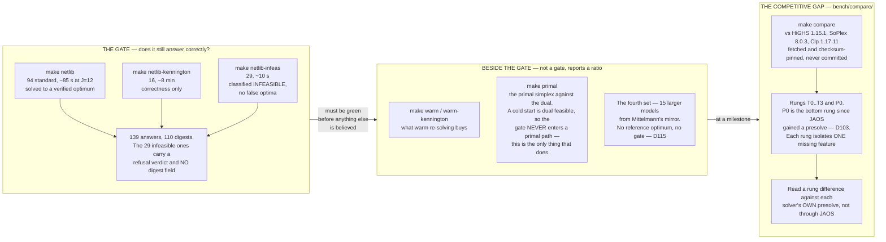

# The development cycle

How a change gets from an idea to a commit in this repository, and what has to
be true at every step before it moves on.

This page is a map. It does not own any number or any rule: `CLAUDE.md` owns
the loop, `bench/README.md` owns the gate, `docs/tolerances.md` owns the
constants, `DECISIONS.md` owns why anything is the way it is. Where this page
and one of those disagree, they are right.

---

## The short version

JAOS is a solver. Its failures are **wrong answers**, not crashes. A wrong
answer looks exactly like a right one until something independent checks it.
So the whole cycle is built around one idea:

> **A green result is not a proof.** Everything is measured against a
> committed baseline, per instance, and a verdict is given by something that
> did not produce the numbers.

Six things make that concrete.

1. **The record is five documents.** A statement lives in exactly one; the
   others cite it.
2. **Nothing is judged on a summary line.** 139 instances, read one by one.
3. **A change is judged on four metrics**, not one.
4. **A refusal is a result**, written down with what would reopen it.
5. **The record is executable.** `make test` fails if the documents lie.
6. **The verdict comes from a fresh context.** The person who built it does
   not get to accept it.

---

## The whole loop

```mermaid
flowchart TD
    START(["An idea, a defect, or a TODO item"]) --> Q0{"Is it in<br/>SPECS.md?"}
    Q0 -->|"no — it is a new feature"| SPEC["Add the SPECS.md row first<br/>status: missing<br/>+ a line in docs/claims.txt<br/>saying it does not exist yet"]
    Q0 -->|"yes"| TODOITEM
    SPEC --> TODOITEM["TODO.md carries the item,<br/>in the order it should happen"]

    TODOITEM --> Q1{"Is the algorithm<br/>already known?"}
    Q1 -->|"no"| SCOUT["literature-scout<br/>finds published technique,<br/>citations checked at the publisher.<br/>Never reads another solver's source"]
    Q1 -->|"yes"| SKILL
    SCOUT --> SKILL["Load the skill for THIS moment<br/>see the table below"]

    SKILL --> CODE["Write the change"]
    CODE --> EDITDONE{"Every source edit<br/>finished?"}
    EDITDONE -->|"no"| CODE
    EDITDONE -->|"yes — even a comment<br/>invalidates a campaign"| WHICH

    WHICH{"What changed?"}
    WHICH -->|"src/ or include/<br/>ANY code"| FULL["THE FULL LOOP"]
    WHICH -->|"bench/*.c, tools/, docs/,<br/>the four documents, Makefile"| MED["make configs,<br/>then the three sets once.<br/>Digests must be byte-identical"]
    WHICH -->|"comments only"| LIGHT["tools/strip-comments.py must print<br/>IDENTICAL CODE, then make test<br/>and the three sets once.<br/>Every digest and work figure identical"]

    FULL --> BUILD
    MED --> LAND
    LIGHT --> LAND

    subgraph build ["1 — Build and test"]
        BUILD{"Did tests/ change,<br/>or a block behind<br/>a build flag?"}
        BUILD -->|"yes"| CONFIGS["make configs<br/>five configurations, make clean between<br/>make does NOT track EXTRA_CFLAGS,<br/>so running them by hand re-runs<br/>the plain binaries and exits 0 — D154"]
        BUILD -->|"no"| TESTSAN["make test<br/>make sanitize — ASan + UBSan"]
        CONFIGS --> RC
        TESTSAN --> RC["make test runs record-check:<br/>every cited decision exists,<br/>every constant matches its source,<br/>every SPECS label is present tense,<br/>docs/claims.txt still holds"]
    end

    RC --> GREEN1{"green?"}
    GREEN1 -->|"no"| CODE
    GREEN1 -->|"yes"| REVIEW

    subgraph review ["2 — Review, before any campaign"]
        REVIEW["numerics-reviewer on the diff<br/>the defect classes tests do not catch:<br/>broken reproducibility, borrowed scratch,<br/>tolerance-space errors, repairs that<br/>hide a residue instead of removing it"]
        REVIEW --> DISP{"Every finding<br/>gets a disposition"}
        DISP -->|"fixed"| REFIX["Fix it — then review the FIXES too.<br/>Round two has found this project's<br/>worst defects, created by round one"]
        DISP -->|"refused"| RREASON["Write the reason down"]
        DISP -->|"carried"| RDEST["Name the destination in TODO.md"]
        REFIX --> REVIEW
    end

    RREASON --> CAMP
    RDEST --> CAMP

    subgraph camp ["3 — The campaigns. A finding after this costs the campaign"]
        CAMP["make netlib netlib-infeas netlib-kennington J=12<br/>ALL THREE SETS, EVERY TIME<br/>139 instances, 139 answers, 110 digests"]
        CAMP --> PRIMAL["make primal — the forced-primal campaign<br/>not a gate: the gate never enters a primal<br/>path, so this is the only thing that does"]
        PRIMAL --> READ["Read the PER-INSTANCE diff<br/>with the jaos-measure scripts.<br/>NEVER the summary line: '0 regressed'<br/>only means no predicate flipped and<br/>nothing passed the 2.0x work bar"]
    end

    READ --> METRICS

    subgraph metrics ["4 — Four metrics, and what each one can see"]
        METRICS["A change is judged on four things — D45, D206"]
        METRICS --> M1["1. Solution digests<br/>CORRECTNESS, and the proof of a no-op"]
        METRICS --> M2["2. Work units<br/>COST. Deterministic, so a regression is<br/>detectable across machines. Goes in the record"]
        METRICS --> M3["3. Instruction count — tools/icount.sh<br/>WHAT UNITS CANNOT SEE: layout, branches,<br/>cache. Deterministic to the instruction"]
        METRICS --> M4["4. A same-instance time ratio<br/>ONLY where the count is not readable.<br/>J=1, minimum over alternating rounds,<br/>geometric mean. The reference host repeats<br/>to 6.27%, D93"]
    end

    M1 --> VERDICT
    M2 --> VERDICT
    M3 --> VERDICT
    M4 --> VERDICT

    subgraph verdict ["5 — The verdict, from a context that did not produce the numbers"]
        VERDICT["jaos-measurer<br/>re-runs every set on the candidate<br/>and reads the evidence itself"]
        VERDICT --> VOUT{"ACCEPT<br/>REJECT<br/>INCONCLUSIVE"}
    end

    VOUT -->|"REJECT"| REFUSE["Write the refusal down.<br/>A refusal is a closed decision and the<br/>most valuable kind DECISIONS.md has"]
    VOUT -->|"INCONCLUSIVE"| MEASURE["Measure the thing it could not read"]
    MEASURE --> CAMP
    VOUT -->|"ACCEPT"| LAND

    subgraph land ["6 — Land it"]
        LAND["Commit"]
        LAND --> L1["CHANGELOG.md — 2 to 6 lines,<br/>what changed and what it cost"]
        LAND --> L2["DECISIONS.md — if a measurement<br/>closed a question. Append-only,<br/>number one past the last, never renumber"]
        LAND --> L3["SPECS.md — if a feature moved"]
        LAND --> L4["docs/tolerances.md — any new constant,<br/>with its sweep on BOTH sides,<br/>beside the constant in the source too"]
        LAND --> L5["bench/measurements/&lt;id&gt;/<br/>the raw readings that decided the verdict,<br/>so it is re-derivable by someone<br/>who does not trust the summary"]
        LAND --> L6["TODO.md — cross the item off<br/>IN THE SAME COMMIT"]
        LAND --> L7["bench/refusals.txt — if this was refused,<br/>with what would reopen it and,<br/>where one exists, the script that re-tests it"]
    end

    L1 --> REOPEN
    L2 --> REOPEN
    L3 --> REOPEN
    L4 --> REOPEN
    L5 --> REOPEN
    L6 --> REOPEN
    L7 --> REOPEN

    REOPEN{"Does this change satisfy<br/>any refusal's reopen condition?<br/>TODO.md carries the table"}
    REOPEN -->|"yes"| LIVE["That question is LIVE again.<br/>A refusal's premise can expire:<br/>D24's did, and D94 caught it by luck"]
    REOPEN -->|"no"| BASE
    LIVE --> BASE

    BASE{"Should a baseline<br/>be rewritten?"}
    BASE -->|"only deliberately,<br/>after the change is read<br/>and accepted"| BASEYES["make netlib-baseline etc.<br/>NEVER as a side effect,<br/>NEVER while the gate is red.<br/>A baseline that updates itself records<br/>whatever just happened as correct"]
    BASE -->|"no"| PUSH
    BASEYES --> PUSH

    PUSH{"Push?"}
    PUSH -->|"needs explicit approval<br/>from the maintainer"| PUSHED(["Pushed.<br/>git fetch first: more than one<br/>contributor lands on main"])
    PUSH -->|"not yet"| HOLD(["Committed, held locally"])

    style FULL fill:#2d3748,color:#fff
    style METRICS fill:#2d3748,color:#fff
    style VERDICT fill:#2d3748,color:#fff
    style PUSHED fill:#22543d,color:#fff
    style REFUSE fill:#742a2a,color:#fff
```

---

## Where the benchmarking actually lives

There are three layers and they answer different questions. Confusing them is
how a session spends an hour proving nothing.

**Why the gate is three sets and not one.** A solver that answers every
feasible model correctly and calls an infeasible one optimal is broken, and no
amount of the first set finds that. Kennington is there because the standard
94 are small: two of them are 74% of the set's total work (D46), so a sum over
the set is a statement about those two and nothing else.

**Why every ratio is a geometric mean of per-instance ratios**, never a ratio
of sums. Same reason.

---

## The record, and why `make test` reads it

Five documents. A statement lives in exactly one; the others point at it. A
measured number has one owner and is never restated.

```mermaid
flowchart TD
    subgraph rec ["The five places, and what each one takes"]
        S["SPECS.md<br/>WHAT JAOS IS BUILT TO BE<br/>and where every feature stands.<br/>Present tense only. History belongs<br/>in DECISIONS.md"]
        T["TODO.md<br/>WHAT IS OPEN, in the order<br/>it should happen. When something<br/>lands, its line leaves in the<br/>same commit"]
        D["DECISIONS.md<br/>CLOSED QUESTIONS and the<br/>measurement that closed each.<br/>Append-only. A refusal is a closed<br/>decision and the most valuable kind"]
        C["CHANGELOG.md<br/>WHAT CHANGED and what it cost.<br/>2 to 6 lines. Reasoning goes<br/>to DECISIONS.md"]
        DOC["docs/<br/>THE CONTRACTS behind every<br/>constant: tolerances, work units,<br/>scaling, formats"]
        BM["bench/<br/>THE GATE, the cross-solver<br/>comparison, and raw measurement<br/>records under measurements/&lt;id&gt;/"]
    end

    CHK["make record-check<br/>tools/record-check.py"]
    CHK -->|"checks"| S
    CHK -->|"checks"| D
    CHK -->|"checks"| DOC

    CHK --> K1["Every cited decision exists,<br/>and its index anchor resolves"]
    CHK --> K2["Every constant in docs/tolerances.md<br/>states the value the SOURCE has"]
    CHK --> K3["Every SPECS.md label is present tense<br/>and every 'partial' row says<br/>what is missing"]
    CHK --> K4["docs/claims.txt lists what the record<br/>says does NOT exist.<br/>This is the line that FAILS when it does —<br/>so add a row for every feature<br/>you mark missing"]
    CHK --> K5["Every measurement script's anchor<br/>still matches, or its evidence<br/>is no longer re-derivable"]

    style CHK fill:#2d3748,color:#fff
    style K4 fill:#742a2a,color:#fff
```

**The point.** Documentation rots silently. Here it fails the build. The first
run of `record-check` found **147 failures** (D206).

---

## Which skill, at which moment

A skill here is a document under `.claude/skills/<name>/SKILL.md`, and an
agent is one under `.claude/agents/`. They are written for an automated
assistant to load, and they read as ordinary documents: a person doing the
same step reads the same file. Each one carries what this project learned
about that step and nowhere else.

Load these **at the moment named**, not when the work is already finished.

| at this moment | load |
|---|---|
| before running or believing any campaign | `jaos-measure` |
| before changing a tolerance, or diagnosing a wrong answer | `fp-numerics` |
| before instrumenting an instance | `jaos-debug` |
| before adding or changing a test, or a checker predicate | `jaos-testing` |
| before writing a landed change up | `jaos-record` |
| before planning performance work on the algorithm | `sparse-simplex-perf` |
| before optimising C, or proposing a compiler flag | `c-perf` |
| before creating or editing a skill or an agent | `skill-authoring` |

The two performance skills are **not** interchangeable. `sparse-simplex-perf`
is the factor-of-N question — what the solver does. `c-perf` is the percentage
question — how the C does it, once the algorithm is settled.

Three subagents, each for work better done in a context that is not the one
that produced the change. Nothing spawns them automatically.

| agent | for |
|---|---|
| `numerics-reviewer` | a diff, before it is measured |
| `jaos-measurer` | a finished candidate: ACCEPT / REJECT / INCONCLUSIVE |
| `literature-scout` | published technique, with citations verified |

---

## Rules that are not obvious from the code

- **Bit-identical results on every machine and every run.** No clock decides
  anything. No iteration order depends on an address. No reassociating
  floating point, no unseeded randomness. `-ffp-contract=off` in the Makefile
  is load-bearing.
- **Every number needs a measurement on both sides.** What a tolerance costs
  when too tight, and what it admits when too loose. Fitting a constant to one
  instance is how this project loses weeks.
- **No dependencies, and no code read from other solvers.** Papers, theses and
  textbooks only. Two closed exceptions: netlib's `emps` as a dev-time
  converter, and Unity for the tests.
- **Work units are the unit of cost; seconds never enter a record.** A
  baseline that changes every run cannot detect a regression.
- **Measure before repairing.** Every failure here that looked like a
  tolerance turned out to be something else.
- **Build the case a predicate must reject**, and confirm it does. A passing
  suite has repeatedly failed to catch real defects here.

---

## The trap that cost the most time

**A probe that measures the wrong thing looks clean.** It does not crash and
it does not return empty — it returns a plausible number that agrees with the
hypothesis. So every measurement script here carries a **control inside the
script**: the instance count, the git ref it measured, and a reading that must
reproduce the committed record. If the control fails, the run refuses.

---

## A worked example, end to end

`D207` is a small change and it went through every step above.

| step | what happened |
|---|---|
| the item | `TODO.md` §0 stage 8: the primal ratio tests used an absolute pivot floor |
| the diagnosis | `bench/measurements/02-120/`: on `pilot87` the floor accepts an FTRAN residue of 1.59e-07 where the true entry is exactly zero |
| the census | one instrumented run recorded, per call, the ratio a floor would test — so **one campaign swept every candidate constant**, and it predicted the affected set exactly, 15 of 15 |
| the sweep | four settings, with `C = 0` as a control that had to reproduce the committed record byte for byte. **The first implementation failed that control** — it billed an extra scan, which shortened the campaign's work budget and moved 18 instances by itself |
| the review | `numerics-reviewer` found two serious defects in what removing a row does to the callers. Both fixed. Both fixes produced a **byte-identical** campaign record, so the record says they are insurance rather than repairs |
| the verdict | `jaos-measurer` ran the parent commit itself rather than trusting the committed record, and returned ACCEPT — plus three errors in the write-up, all corrected |
| landed | `DECISIONS.md` D207, `docs/tolerances.md` row with the sweep on both sides, `bench/measurements/02-122/`, `SPECS.md` 55 → 56, `CHANGELOG.md`, `TODO.md` crossed off |

Three follow-ups came out of its own review, and each got the same treatment:
**D208** closed one on a measurement, **D209** landed a change and corrected a
document that described a constant as the wrong kind of floor, **D210**
refused one and left an executable re-test behind.
