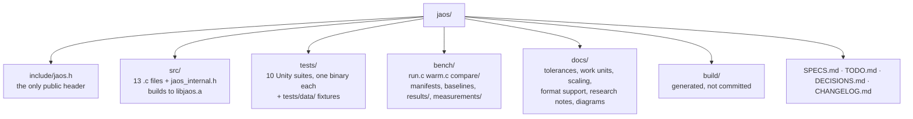
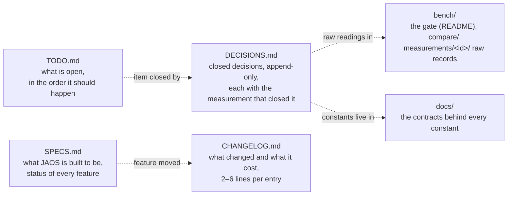

# 01 — Repo map

What each directory holds, and which document owns which kind of statement.
Traced at commit `33bb85d`.

## The tree

There is no CLI. The library ships no `main`. The executables in the tree
are the bench drivers (`bench/run.c`, `bench/warm.c`,
`bench/compare/jaos_time.c`) and the test binaries.

## The record — five documents, one owner per statement

A statement lives in exactly one place; the others point at it. A measured
number has one owner.

| kind of statement | owner |
|---|---|
| what a feature is and where it stands | `SPECS.md` |
| what to do next, and refusals with reopen conditions | `TODO.md` |
| why a question closed, with its measurement | `DECISIONS.md` (append-only, never renumber) |
| what landed and what it cost | `CHANGELOG.md` |
| a tolerance, a threshold, a work-unit definition | `docs/` beside the source constant |
| a verdict's raw readings | `bench/measurements/<id>/` |
| committed per-instance baselines | `bench/*.baseline` (rewritten only by `*-baseline` targets) |

## Why

- **One owner per number** because every figure copied into prose has
  drifted here before. The other documents link, never restate.
- **`DECISIONS.md` is append-only** so a refusal stays visible. A refusal is
  a closed decision, and its premise can expire (see D24 → D94).
- **`build/` and the instance directories are not committed**; instances are
  fetched by `bench/fetch.sh` and verified by pinned sha256.
