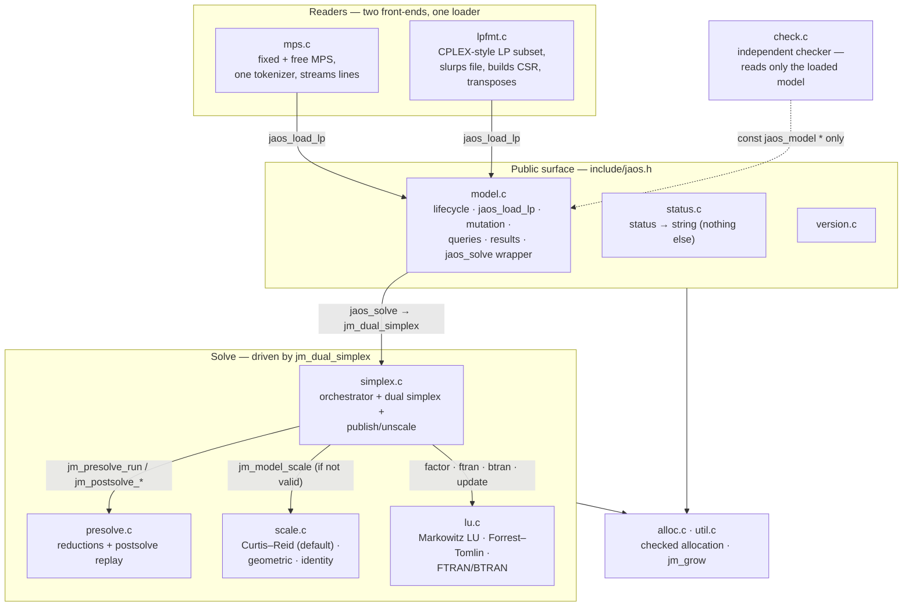

# 02 — Modules and who calls whom

The 13 source files, grouped by role, and the call edges between them.
Traced at commit `33bb85d`.

## The map

## Each file in one line

| file | role | key entries |
|---|---|---|
| `model.c` | the model: load, validate, mutate, query, results, basis storage | `jaos_model_new`, `jaos_load_lp`, `jaos_solve`, `jaos_solution`, `jaos_set_basis` |
| `mps.c` | MPS reader (fixed and free through one whitespace tokenizer) | `jaos_read_mps` |
| `lpfmt.c` | LP-format reader (documented subset, `docs/format-support.md`) | `jaos_read_lp` |
| `simplex.c` | orchestration, dual simplex, publish and unscale | `jm_dual_simplex`, `run`, `pivot`, `publish` |
| `presolve.c` | six reduction families, record arena, LIFO postsolve | `jm_presolve_run`, `jm_postsolve_expand` |
| `scale.c` | matrix scaling, exact powers of two | `jm_model_scale` |
| `lu.c` | sparse LU, Markowitz threshold pivoting, Forrest–Tomlin updates | `jm_lu_factor`, `jm_lu_update`, `jm_lu_ftran`, `jm_lu_btran` |
| `check.c` | independent solution checker | `jaos_check_solution` |
| `status.c` | status-code names | `jaos_status_str`, `jaos_solve_status_str` |
| `version.c` | version string | `jaos_version` |
| `alloc.c` | overflow-checked array allocation (C23 `ckd_mul`) | `jm_alloc_array`, `jm_calloc_array` |
| `util.c` | geometric array growth | `jm_grow` |
| `jaos_internal.h` | internal structs: model, LU, work units, presolve records | — |

## Why the shape is this

- **Two readers converge on one validating loader** (`jaos_load_lp`), so
  every model in memory passed the same checks, whatever file it came from.
- **`check.c` has no edge into the solver.** It reads the model as loaded:
  no scaling, no factorization, no solver state. That independence is the
  point of the checker (D18); it deliberately duplicates the reduced-cost
  loop instead of sharing it.
- **`simplex.c` owns the pipeline order.** `jaos_solve` is a three-line
  wrapper; `jm_dual_simplex` strings presolve, scaling, basis, loop and
  publish together. See `03-solve-pipeline.md`.
- **`status.c` sets nothing.** Every status is set in `simplex.c`,
  `presolve.c` or `model.c`; see `06-outcomes.md`.
