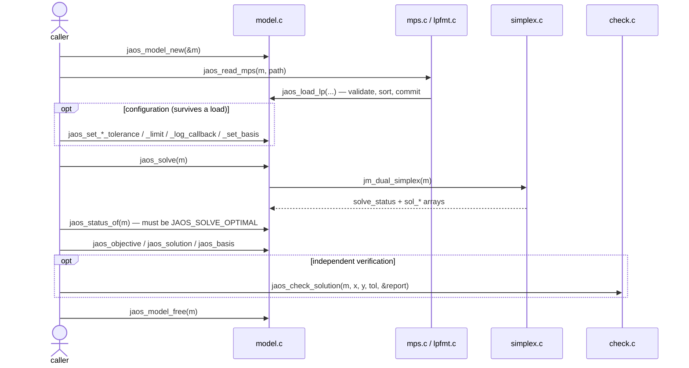
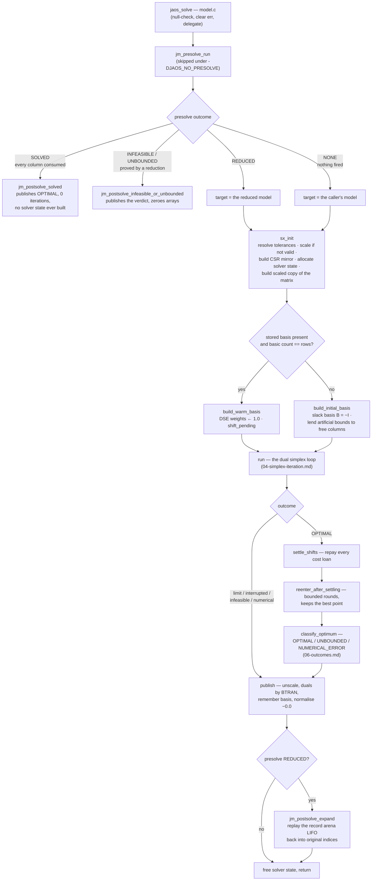
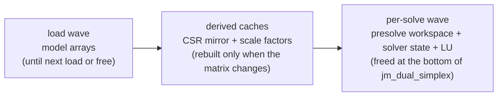

# 03 — The solve pipeline, end to end

From a file on disk to an answer a caller can read. Traced at commit
`33bb85d`.

## The minimal caller

Rules a sequence diagram cannot show:

- `jaos_objective`, `jaos_solution` and `jaos_basis` refuse unless the
  status is `JAOS_SOLVE_OPTIMAL`. A stale answer is an error, never a
  number.
- Any model mutation (`jaos_set_*`, add/delete) discards the answer and
  resets the status to `NOT_RUN`. The stored basis survives mutation; a
  load drops it. That is what makes warm re-solve automatic (D68).
- Settings (`m->cfg`) survive a load, so `set → read → solve` works.

## Inside `jaos_solve` — the orchestrator `jm_dual_simplex`

## Why each stage exists

- **Presolve before anything** removes what no iteration should pay for,
  and can prove infeasibility or unboundedness without building the solver
  at all. It reads the model through a `const` pointer; the caller's model
  is never rewritten.
- **Scaling** (Curtis–Reid, exact powers of two) exists so one badly scaled
  row cannot poison the pivoting; powers of two keep every application
  exact, which bit-identical results require (D8). The stored matrix is
  never modified; the solver works on a scaled copy.
- **The slack basis** is the cold start because its steepest-edge weights
  are exactly 1.0 — a crash basis was measured and refused for destroying
  them (SPECS §3).
- **Publish is the only unscale point**, and it normalises `−0.0` to `0.0`
  so byte-for-byte digest comparison stays a valid no-op instrument (D21).
- **Postsolve replays the reduction record strictly LIFO**, so each undo
  sees exactly the model state its reduction saw.

## The sub-cases

| condition | where it forks | effect |
|---|---|---|
| `-DJAOS_NO_PRESOLVE` (reference build) | compile-time, in `simplex.c` only | presolve and postsolve compiled out; solver runs on the caller's model; the only oracle for output no predicate judges (D96, `jaos-testing`) |
| presolve fires nothing | outcome `NONE` | no reduced model is allocated; publish writes straight into the caller's model |
| presolve consumes every column | outcome `SOLVED` | answer published with zero simplex iterations |
| MAXIMIZE model | `sigma = −1` folded into costs at `sx_init`; flipped back at publish; presolve and checker read the sense themselves (D103) | internally everything is minimize |
| warm basis stored | `build_warm_basis` succeeds | no artificial bounds lent; dual feasibility bought by one cost-shift sweep at the first refresh |
| LP vs MPS input | the caller picks the function | no sniffing; both converge on `jaos_load_lp` |
| work/time limit, callback stop | inside `run` | basis is written and remembered, published statuses then zeroed: resumable, but nothing readable in between (D70, D79) |

## Memory, in three waves

The six `sol_*` answer arrays and the two `start_*` basis arrays are the
only per-solve products that outlive the solve. `alloc.c` is two functions
with C23 overflow-checked multiplication; there is no arena and no pool.
