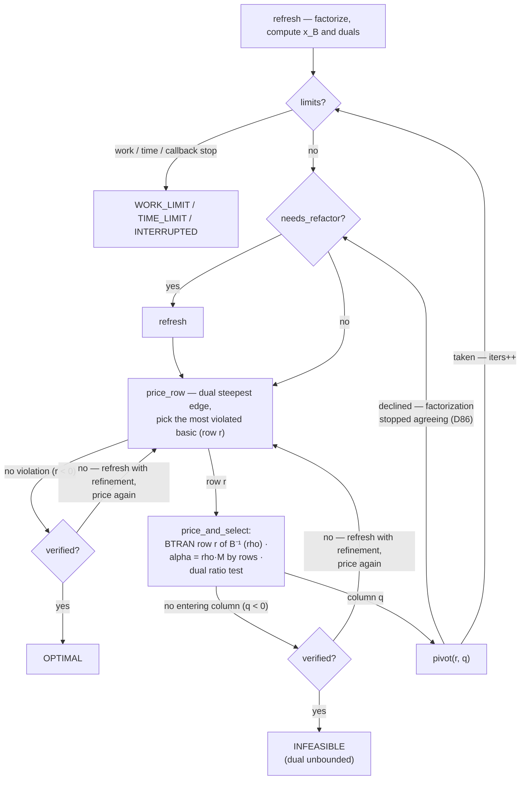
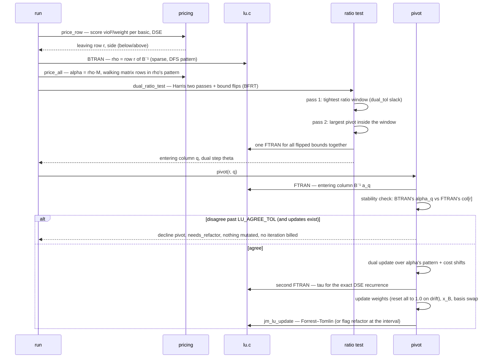
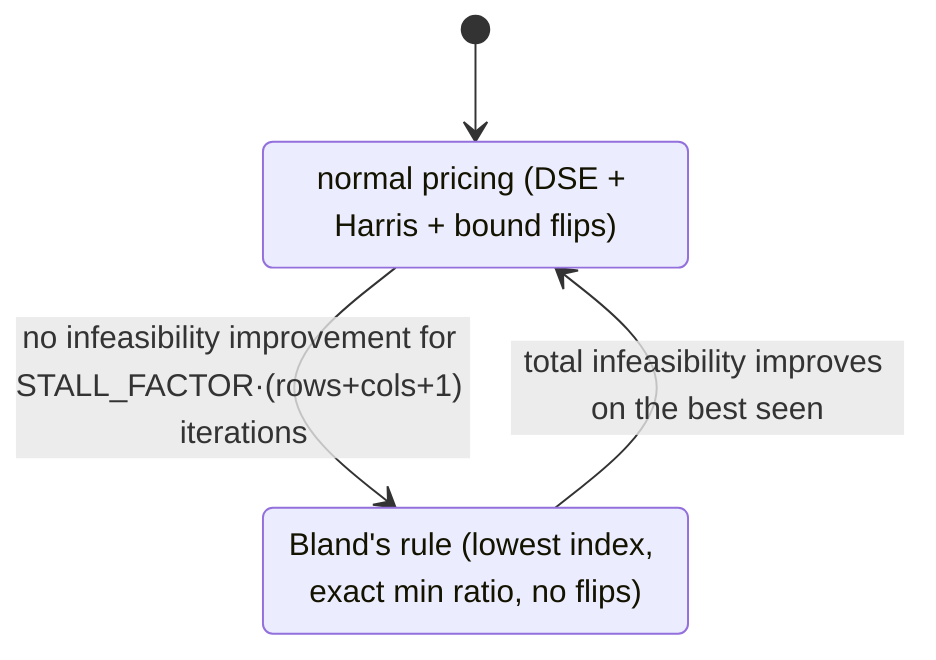
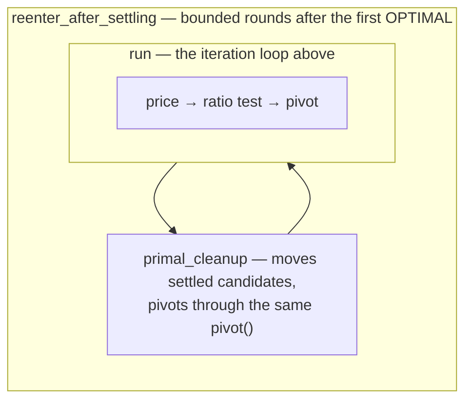

# 04 — The dual simplex loop and the LU

What `run` does every iteration, when the factorization is rebuilt, and
what turns Bland's rule on. Traced at commit `33bb85d`. Constants named
here live in `src/simplex.c` and `src/lu.c` with their sweeps, and in
`docs/tolerances.md`.

## The method in one paragraph

A bounded-variable dual simplex on `M z = 0` with `M = [A | −I]`: every row
gets a logical, so rows and columns are one kind of object. There is no
separate phase 1. Dual feasibility is bought at basis construction by
lending artificial bounds to free columns (cold start), and maintained
during the solve by cost shifting; every loan is repaid before any verdict.

## The `run` loop

**The verified rule (D20, D39):** neither OPTIMAL nor INFEASIBLE is ever
declared on carried numbers. The first time pricing finds nothing, the
factorization is rebuilt with iterative refinement and the question is
asked again. Only a repeat of the same answer on fresh numbers becomes a
verdict. Every basis change clears `verified`.

## One iteration, as a sequence

Why the check in the middle: the pivot element is computed twice anyway,
once by BTRAN and once by FTRAN. In exact arithmetic they are equal. When
they drift apart, the factorization no longer describes the basis, and
pivoting on it is what produced `pilot87`'s stall (D72 → D86). The declined
pivot costs nothing and is not billed.

## When the factorization is rebuilt

| trigger | where |
|---|---|
| update count reaches `REFACTOR_EVERY` | `pivot`, before calling `jm_lu_update` |
| a Forrest–Tomlin update fails (numerical or memory) | `pivot` — the failure is absorbed into a scheduled rebuild |
| BTRAN/FTRAN pivot disagreement past `LU_AGREE_TOL` (D86) | `pivot`, declining the iteration |
| a verdict needs verifying (the two-opinion rule) | `run`, with iterative refinement |
| re-entry and restore paths | `reenter_after_settling` |

There is no fill-based trigger. `refresh` also repairs a singular basis:
up to `REPAIR_ATTEMPTS` rounds of patching uncovered rows with logicals,
after which the solve is abandoned as `NUMERICAL_ERROR`.

## The LU itself

- **Factor**: Markowitz cost `(r−1)(c−1)` with threshold pivoting, columns
  bucketed by live count; the search stops early on a perfect pivot, after
  `PIVOT_SEARCH_LIMIT` columns, or when the bucket bound proves no better
  exists (D46).
- **Update**: Forrest–Tomlin — spike through the eta file, cyclic
  permutation, one eta pushed per elimination step. A rejected update wrecks
  nothing: it flags a rebuild.
- **Solves**: FTRAN and BTRAN report their result's sparsity pattern;
  BTRAN's U-solve walks only the DFS-reachable slots (hyper-sparsity,
  D38/D44). Consumers switch between sparse and dense paths on measured
  thresholds (`SPARSE_*` constants).

## Degeneracy: the Bland fallback

Bland is a fallback a detected stall switches on, never the default (D26):
it terminates but crawls, so it runs only while progress is provably
stopped. Progress is measured as total primal infeasibility, accumulated
for free during pricing.

## Three nested loops share the iteration counter

After the first OPTIMAL, `settle_shifts` repays every cost loan; repaying
can re-open dual infeasibility, so `reenter_after_settling` runs more
rounds, keeps the best point seen (dual-feasible first, then lowest
objective, D89) and can roll back to it. `s->iters` accumulates across all
three loops, so one sanity cap covers them all.
