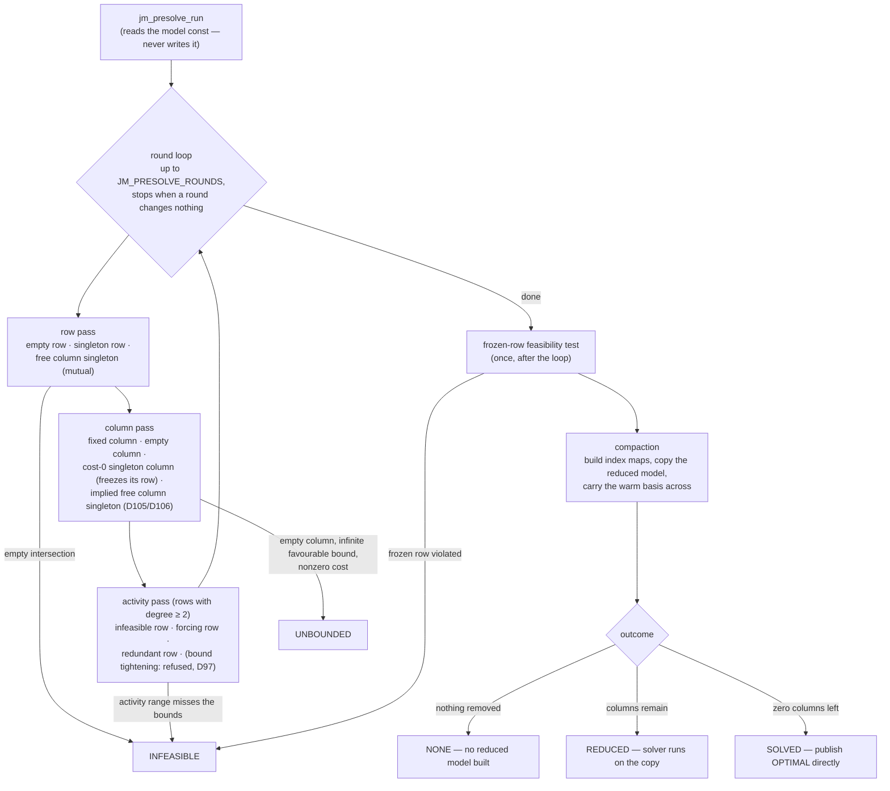
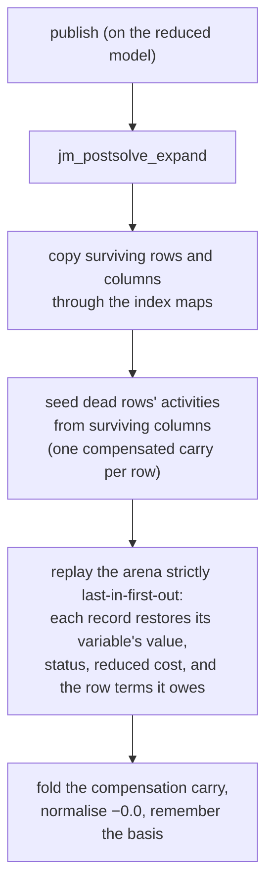

# 05 — Presolve and postsolve

The reduction families, the order they run in, the record that makes undo
possible, and the replay. Traced at commit `33bb85d`. Windows and caps live
in `src/presolve.c` and `docs/tolerances.md`; what each family is worth is
in D95, D103, D105, D106.

## The round loop

## The families, and what each pushes onto the record

Every reduction pushes one record (tag + the numbers its undo needs) onto
an append-only arena. `index` is always an original index.

| family | fires when | record tag |
|---|---|---|
| empty row | row has no live entries | `JM_PS_EMPTY_ROW` |
| singleton row | one live entry: fold the row bound into the column | `JM_PS_SINGLETON_ROW` |
| fixed column | lower == upper: substitute and drop | `JM_PS_FIXED_COL` |
| empty column | no live entries: pin to its favourable bound | `JM_PS_EMPTY_COL` |
| cost-0 singleton column | one live entry, zero cost, bounded: relax and freeze its row (D95) | `JM_PS_SINGLETON_COL` |
| free column singleton | mutual singleton, zero cost, free: solve its row for it (D95) | `JM_PS_FREE_COL_SINGLETON` |
| implied free column singleton | equality row implies a box strictly inside the column's own (D105, D106) | `JM_PS_IMPLIED_FREE_COL` |
| forcing row | activity range touches a row bound: pin every column (only onto bounds the caller declared) | `JM_PS_FORCING_ROW`, after its `JM_PS_FIXED_COL`s |
| redundant row | activity range strictly inside the row bounds | `JM_PS_REDUNDANT_ROW` |

Not implemented, with the count that defers them: duplicate rows and
columns, dominated columns (D101). Refused with six designs measured:
bound tightening (D97).

## Why it is built this way

- **Const input.** Presolve builds a reduced copy; the caller's model is
  the checker's ground truth and must survive untouched.
- **Early outcomes are cheap proofs.** Four sites prove INFEASIBLE and one
  proves UNBOUNDED before any factorization exists. The empty-column rule
  is the one family permitted to report unboundedness (D19's exception):
  its ray is trivial.
- **Freezing a row** (cost-0 singleton column) marks bounds that no longer
  describe it; every later family must refuse a frozen row, and the
  round-order defects D99, D102 and D117 all lived on that edge.
- **Its own tolerance space.** Presolve judges residues in the unscaled
  model, with windows counted in roundings (ulps), not tunables (D103).

## Postsolve — the LIFO replay

LIFO is load-bearing: each undo must see the model state its reduction
saw. A removed column pays its share into every row it touched, through a
compensated (Neumaier) accumulator — two families short-changed this and
D106 made them pay. The dual side is derived per record: a singleton row
decides whether it owns the bound its column rests on before deriving the
multiplier (D99, D100).

Two short-circuit publishers never build solver state at all:
`jm_postsolve_solved` (outcome SOLVED) and
`jm_postsolve_infeasible_or_unbounded` (outcomes proved by reductions).

## The reference build

`EXTRA_CFLAGS=-DJAOS_NO_PRESOLVE` compiles the guard out in `simplex.c`;
`presolve.c` still compiles but never runs. The off-build must reproduce
the pre-presolve baselines bit for bit (D96), and it is the only oracle
for published output no predicate judges — basis statuses above all
(`jaos-testing`).
