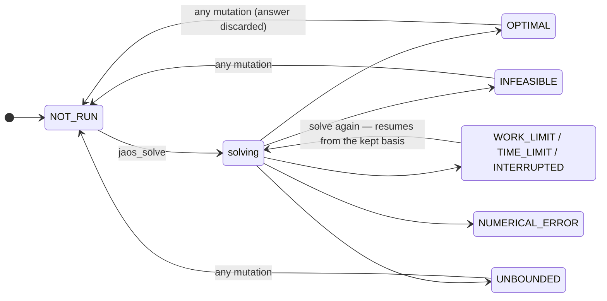
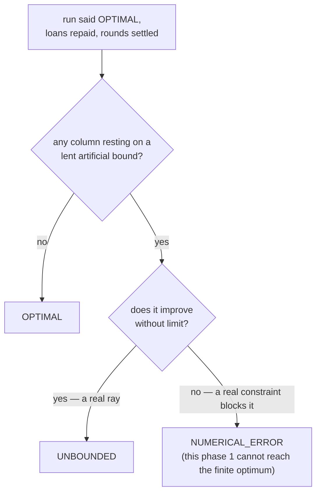
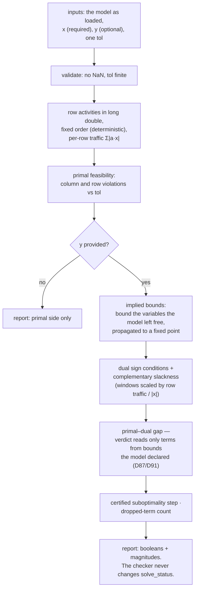

# 06 — Outcomes: every terminal status, and the checker

What a solve can end as, which code decides it, and what the independent
checker verifies afterwards. Traced at commit `33bb85d`.

## The status lifecycle

Results (`jaos_objective`, `jaos_solution`, `jaos_basis`) are readable only
at OPTIMAL. A stopped solve keeps its basis so the next solve resumes
(D70); a NUMERICAL_ERROR is the one outcome that keeps none.

## Who sets each status

| status | decided by |
|---|---|
| OPTIMAL | `run` — pricing finds no violation, **and the verdict is re-verified on a fresh factorization** (D20); or presolve consumed every column; then `classify_optimum` confirms no lent bound is load-bearing |
| INFEASIBLE | `run` — no entering column, re-verified the same way (D39); or presolve proves it (4 sites: empty row, singleton fold, activity range, frozen row) |
| UNBOUNDED | `classify_optimum` — a column rests on a lent artificial bound and provably improves without limit (read off a ray, never an invented bound, D19); or presolve's empty-column rule |
| WORK_LIMIT / TIME_LIMIT | `run`, budget checks (work every iteration, time every 64) |
| INTERRUPTED | `run`, the progress callback said stop (asked on a fixed iteration count, so *when* is reproducible, D79) |
| NUMERICAL_ERROR | a refresh failed after singular-basis repair; a verifying refresh failed; or `classify_optimum` found a lent bound blocked by a real constraint — an honest refusal instead of a wrong UNBOUNDED |

### `classify_optimum`, the last gate before OPTIMAL

### Mutation sites of `m->solve_status`

Nine sites write it, and two are invisible to a text search for the field:
a whole-struct copy in presolve's compaction and the `memset` in
`model_release_arrays`. The rest: zero-init at `jaos_model_new`,
`model_answer_is_stale` (every mutator), presolve's reduced-model init,
the field copy in `jm_postsolve_expand`, `jm_postsolve_solved`,
`jm_postsolve_infeasible_or_unbounded`, and `publish`. When auditing
status behaviour, grep is not enough (see also the per-variable
`s->status` array in `simplex.c`, a different thing with ~20 write sites).

## The independent checker — `jaos_check_solution`

Why it is shaped this way:

- **Original space only.** No scaling, no basis, no solver state. It judges
  the answer against the model the caller loaded, which is why the solver
  may never rewrite that model (D18).
- **A check failure changes nothing in the library.** The checker fills a
  report; consumers act. In the gate, `bench/run.c` turns
  `primal_feasible && dual_feasible` into the `checker=` predicate.
- **The verdict reads declared bounds only** (D91): an implied bound's term
  can be live at a correct optimum, so reading it would reject right
  answers. The bound it still computes is reported separately.
- **What it does not do**: it never reads a basis status, and it certifies
  against tolerances, not exactly (SPECS §5 lists exact rational
  verification as missing).

## Warm start vs cold start

| | cold (`build_initial_basis`) | warm (`build_warm_basis`) |
|---|---|---|
| basis | slack basis, B = −I | the stored statuses, repaired if a bound went infinite (D90) |
| DSE weights | exactly 1.0 (a fact) | 1.0 (a prior) |
| dual feasibility | by lending artificial bounds to free columns | by one cost-shift sweep at the first refresh; no bounds lent |
| LU | factorized fresh | factorized fresh — nothing is carried |
| entered when | no stored basis, or basic count mismatch | an optimum, a stop, or `jaos_set_basis` left statuses on the model |

What warm re-solve is worth is measured in D69/D90; the `warm` campaign
reports it as a ratio and is not a gate.
