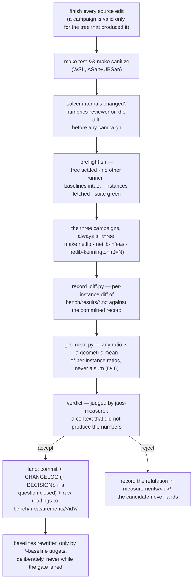
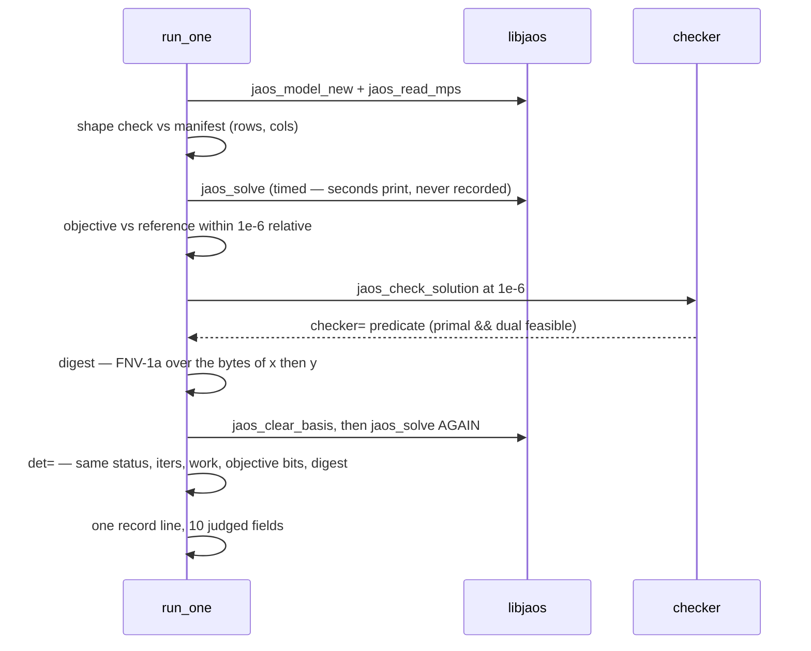
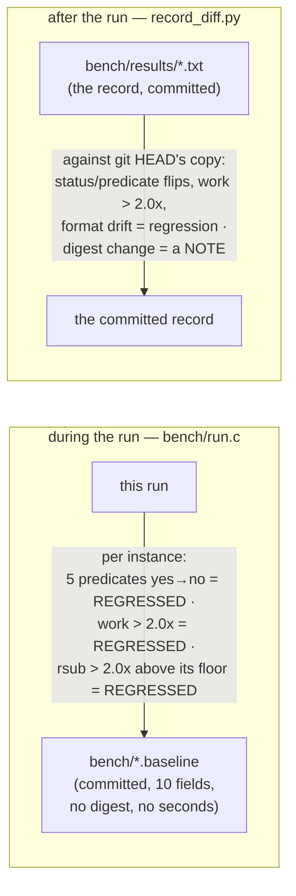

# 07 — The gate: how a change is judged

The path every change travels, what one campaign run does per instance,
and the two comparisons that decide a verdict. Traced at commit `33bb85d`.
The gate's own contract is `bench/README.md`; the scripts are
`.claude/skills/jaos-measure/scripts/`.

## The loop a change travels

## What one instance goes through (`bench/run.c`)

The `jaos_clear_basis` between the two solves is what makes the second a
cold solve; without it the determinism check would measure a warm re-solve
(D68). The infeasible set expects `verdict=ok` (refused, no false optimum)
and carries no digest and no checker verdict.

## The two comparisons — do not conflate them

- **The digest never fails the gate.** It is evidence: every instance
  bit-identical to the committed record is the strongest available proof
  that a change is a no-op.
- **A summary line saying `0 regressed` means only that no predicate
  flipped and no instance crossed 2.0x work.** Read the per-instance diff;
  ten commits once reached main under an unmoved summary line
  (`bench/README.md`).
- **Seconds never enter a record or a baseline.** Work units are the cost;
  a time ratio is taken only where units cannot see the change, at `J=1`,
  minimum over alternating rounds, geometric mean (D45, D93).

## What is judged, in one table

| judgement | rule | consequence |
|---|---|---|
| shape | rows/cols match the manifest | predicate |
| objective | within 1e-6 relative of the reference | predicate |
| checker | primal and dual feasible at 1e-6 | predicate |
| determinism | second cold solve bit-identical | predicate |
| work | ≤ 2.0x the baseline, per instance | regression → exit 1 |
| suboptimality bound | ≤ 2.0x the baseline above its floor | regression → exit 1 |
| digest | vs the committed record | note — no-op evidence |
| record format | columns appear/disappear | regression (not comparable) |

## Everything else in `bench/`

- `make warm` / `warm-kennington` — what warm re-solving buys; reports a
  ratio, not a verdict; no baseline.
- `bench/compare/` — the competitive ladder against HiGHS, SoPlex and Clp;
  its own record, the one place seconds are allowed; rung definitions in
  `bench/compare/README.md`.
- `make pgo` — profile-guided rebuild; deliberately not part of `make`.
- `bench/measurements/<id>/` — raw readings behind each verdict, so every
  verdict is re-derivable; throwaway diagnostic drivers live and die here.
- `plato*` targets — the large-instance set; explicitly not the gate.
